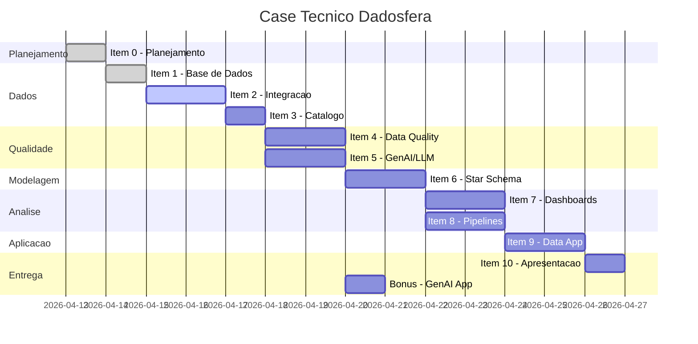

# LEONARDO_NUNES_DDF_TECH_042026

> Case Tecnico Dadosfera - Plataforma de Dados para E-commerce

---

## Sobre o Projeto

Este repositorio contem a implementacao completa do Case Tecnico Base da Dadosfera, simulando a construcao de uma **Plataforma de Dados** para uma grande empresa de e-commerce. O projeto cobre todo o **Ciclo de Vida dos Dados** conforme definido pela Dadosfera: do Integrar ate IA Generativa.

**Candidato:** Leonardo Nunes
**Data:** Abril 2026
**Nivel de entrega:** Excelente (todos os itens + bonus)

---

## Indice

| Item | Descricao | Status | Link |
|------|-----------|--------|------|
| [Item 0](#item-0---planejamento) | Planejamento e Agilidade | Completo | [docs/00_project_plan.md](docs/00_project_plan.md) |
| [Item 1](#item-1---base-de-dados) | Base de Dados | Completo | [docs/01_database_selection.md](docs/01_database_selection.md) |
| [Item 2](#item-2---integrar) | Integrar (Dadosfera) | Completo | [docs/02_integration.md](docs/02_integration.md) |
| [Item 3](#item-3---explorar) | Explorar e Catalogar | Completo | [docs/03_data_catalog.md](docs/03_data_catalog.md) |
| [Item 4](#item-4---data-quality) | Data Quality | Completo | [docs/04_data_quality.md](docs/04_data_quality.md) |
| [Item 5](#item-5---genai-e-llms) | GenAI e LLMs | Completo | [docs/05_genai_features.md](docs/05_genai_features.md) |
| [Item 6](#item-6---modelagem-de-dados) | Modelagem de Dados | Completo | [docs/06_data_modeling.md](docs/06_data_modeling.md) |
| [Item 7](#item-7---analise-de-dados) | Analise de Dados | Completo | [docs/07_analysis.md](docs/07_analysis.md) |
| [Item 8](#item-8---pipelines) | Pipelines | Completo | [docs/08_pipelines.md](docs/08_pipelines.md) |
| [Item 9](#item-9---data-app) | Data App (Streamlit) | Completo | [docs/09_data_app.md](docs/09_data_app.md) |
| [Item 10](#item-10---apresentacao) | Apresentacao | Completo | [docs/10_architecture.md](docs/10_architecture.md) |
| [Bonus](#bonus---genai--data-app) | GenAI + Data App | Completo | [notebooks/05_bonus_product_presenter.py](notebooks/05_bonus_product_presenter.py) |

---

## Estrutura do Repositorio

```
case-dadosfera/
├── README.md                          # Este arquivo
├── requirements.txt                   # Dependencias Python
├── .env.example                       # Template de variaveis de ambiente
│
├── docs/                              # Documentacao de cada item
│   ├── 00_project_plan.md             # Item 0: PMBOK, Gantt, riscos
│   ├── 01_database_selection.md       # Item 1: Selecao de datasets
│   ├── 02_integration.md              # Item 2: Guia de integracao Dadosfera
│   ├── 03_data_catalog.md             # Item 3: Dicionario de dados
│   ├── 04_data_quality.md             # Item 4: Estrategia de qualidade
│   ├── 05_genai_features.md           # Item 5: Feature extraction com LLM
│   ├── 06_data_modeling.md            # Item 6: Star Schema Kimball
│   ├── 07_analysis.md                 # Item 7: Dashboard e analises
│   ├── 08_pipelines.md               # Item 8: Pipeline ETL + ML
│   ├── 09_data_app.md                # Item 9: Streamlit Data App
│   ├── 10_architecture.md            # Item 10: Arquitetura Dadosfera
│   └── diagrams/                      # Diagramas e imagens
│
├── notebooks/                         # Notebooks (Google Colab)
│   ├── 01_eda_exploration.py          # EDA completo
│   ├── 02_data_quality_ge.py          # Great Expectations
│   ├── 03_llm_feature_extraction.py   # GPT feature extraction
│   ├── 04_ml_pipeline.py             # ETL + ML pipeline
│   └── 05_bonus_product_presenter.py  # Bonus: DALL-E product presenter
│
├── sql/                               # Queries SQL (Snowflake)
│   ├── ddl/
│   │   └── star_schema.sql            # DDL do Star Schema
│   ├── etl/
│   │   ├── raw_to_trusted.sql         # ETL: Raw -> Trusted
│   │   └── trusted_to_refined.sql     # ETL: Trusted -> Refined
│   └── analytics/
│       └── dashboard_queries.sql      # 7 queries para dashboards
│
├── streamlit_app/                     # Data App Streamlit
│   ├── app.py                         # App principal
│   ├── requirements.txt               # Dependencias do app
│   └── pages/
│       ├── 1_📊_Analise_Exploratoria.py
│       ├── 2_🔍_Similaridade_Produtos.py
│       ├── 3_🤖_GenAI_Features.py
│       └── 4_🎨_Product_Presenter.py
│
├── scripts/                           # Scripts utilitarios
│   ├── download_data.py               # Download dos datasets
│   └── dadosfera_api.py               # Client API Dadosfera
│
└── data/                              # Dados (nao versionados)
    ├── olist/                         # CSVs do Olist
    └── amazon/                        # Amostra Amazon Products
```

---

## Item 0 - Planejamento

**Artefato:** [docs/00_project_plan.md](docs/00_project_plan.md)

Planejamento completo seguindo as melhores praticas do **PMBOK**, incluindo:

- **Termo de Abertura do Projeto** com objetivos SMART
- **EAP (WBS)** com decomposicao de todos os itens do case
- **Cronograma Gantt** (formato Mermaid, renderizavel no GitHub)
- **Matriz de Dependencias** e caminho critico (CPM)
- **Analise de Riscos** com 12 riscos identificados, probabilidade, impacto e mitigacao
- **Estimativas de Custos** (total < US$ 1.00 com GPT-4o-mini)
- **Alocacao de Recursos** com heatmap de utilizacao



---

## Item 1 - Base de Dados

**Documentacao:** [docs/01_database_selection.md](docs/01_database_selection.md)

### Dataset Principal: Olist Brazilian E-Commerce

- **Fonte:** [Kaggle - Olist](https://www.kaggle.com/datasets/olistbr/brazilian-ecommerce)
- **Volume:** 100.000+ pedidos, 9 tabelas relacionais
- **Periodo:** 2016 a 2018
- **Total de registros:** ~1.550.000+ (somando todas as tabelas)

| Tabela | Registros | Descricao |
|--------|-----------|-----------|
| olist_orders_dataset | ~99.441 | Pedidos |
| olist_order_items_dataset | ~112.650 | Itens dos pedidos |
| olist_order_payments_dataset | ~103.886 | Pagamentos |
| olist_order_reviews_dataset | ~99.224 | Avaliacoes |
| olist_customers_dataset | ~99.441 | Clientes |
| olist_products_dataset | ~32.951 | Produtos |
| olist_sellers_dataset | ~3.095 | Vendedores |
| olist_geolocation_dataset | ~1.000.163 | Geolocalizacao |
| product_category_name_translation | ~71 | Traducao categorias |

### Dataset Complementar: Amazon Product Data

- **Fonte:** [UCSD Amazon Product Data](https://jmcauley.ucsd.edu/data/amazon/)
- **Uso:** Feature extraction com LLM (Item 5)
- **Formato:** JSON com titulo e descricao de produtos

**Justificativa:** O Olist e o dataset ideal para este case por ser brasileiro, ter volume adequado (100k+), e oferecer multiplas dimensoes de analise (vendas, satisfacao, logistica, geografia). As reviews em texto permitem analise NLP e os dados de geolocalizacao permitem visualizacoes em mapa.

---

## Item 2 - Integrar

**Guia:** [docs/02_integration.md](docs/02_integration.md)

Processo de integracao dos dados na Dadosfera utilizando o modulo de **Coleta**:

1. Upload dos 9 CSVs via interface do modulo Coletar
2. Configuracao de tipos de dados e encoding (UTF-8)
3. Organizacao em zonas do Data Lake (Raw / Trusted / Refined)
4. Verificacao de carga (contagem de registros)

**Script de download:** [scripts/download_data.py](scripts/download_data.py)

<!-- PRINTS: Adicionar screenshots da Dadosfera aqui -->
<!--  -->

---

## Item 3 - Explorar

**Dicionario de Dados:** [docs/03_data_catalog.md](docs/03_data_catalog.md)

Catalogo completo com dicionario de dados para todas as 9 tabelas, incluindo:

- Nome, tipo, descricao e regras de negocio para cada coluna
- Organizacao em zonas do Data Lake (Bronze/Silver/Gold)
- Metadados de cada asset na Dadosfera

**Organizacao no Data Lake:**

```
├── Raw Zone (Bronze)      ← Dados originais, sem transformacao
├── Trusted Zone (Silver)  ← Dados limpos, tipados, deduplicados
└── Refined Zone (Gold)    ← Star Schema dimensional
```

**Bonus:** Script de catalogacao via API da Dadosfera em [scripts/dadosfera_api.py](scripts/dadosfera_api.py)

<!-- PRINTS: Adicionar screenshots do catalogo na Dadosfera -->
<!--  -->

---

## Item 4 - Data Quality

**Documentacao:** [docs/04_data_quality.md](docs/04_data_quality.md)
**Notebook:** [notebooks/02_data_quality_ge.py](notebooks/02_data_quality_ge.py)

Relatorio de qualidade de dados utilizando **Great Expectations**, cobrindo:

| Dimensao | Verificacoes |
|----------|-------------|
| **Completude** | Campos obrigatorios sem nulos |
| **Unicidade** | order_id, customer_id, review_id unicos |
| **Validade** | price > 0, review_score entre 1-5 |
| **Consistencia** | data_compra < data_entrega |
| **Integridade** | FKs existem nas tabelas pai |

**Principais achados:**
- ~610 produtos sem categoria (2%)
- ~2.6% de pedidos sem data de aprovacao
- Reviews sem comentario: ~58% (comportamento esperado)
- Entregas atrasadas: ~7.8% do total

**Bonus:** Proposta de Common Data Model para padronizacao dos dados.

---

## Item 5 - GenAI e LLMs

**Documentacao:** [docs/05_genai_features.md](docs/05_genai_features.md)
**Notebook:** [notebooks/03_llm_feature_extraction.py](notebooks/03_llm_feature_extraction.py)

Transformacao de dados nao-estruturados em features utilizando **GPT-4o-mini**:

### Entrada (texto nao-estruturado):
```
Title: FYY Leather Case with Mirror for Samsung Galaxy S8 Plus...
Description: Premium PU Leather Top quality. Made with Premium PU Leather...
```

### Saida (features estruturadas):
```json
{
  "category": "Phone Accessories",
  "material": "Premium PU Leather",
  "features": {
    "receiver_design": "Accurate cut-out for receiver",
    "hand_strap": true,
    "RFID_protection": true,
    "handmade": true,
    "card_slots": true,
    "cosmetic_mirror": true,
    "kickstand": true
  },
  "compatibility": "Samsung Galaxy S8 Plus",
  "keywords": ["leather case", "wallet", "RFID", "mirror"]
}
```

**Estrategia:**
- Modelo: GPT-4o-mini (custo-beneficio: ~94% mais barato que GPT-4o)
- Prompt: Few-shot com exemplo do case
- Validacao: Schema JSON + regras de consistencia
- Custo estimado: ~US$ 0.02 por 100 produtos

---

## Item 6 - Modelagem de Dados

**Documentacao:** [docs/06_data_modeling.md](docs/06_data_modeling.md)
**DDL SQL:** [sql/ddl/star_schema.sql](sql/ddl/star_schema.sql)

Modelagem **Kimball Star Schema** com 2 visoes analiticas:

### Visao 1 - Analise de Vendas

```
     dim_customer ─────┐
                       │
     dim_product ──────┤── fact_orders ──┤── dim_seller
                       │                │
     dim_date ─────────┘                └── dim_geography
```

### Visao 2 - Analise de Satisfacao

```
     dim_customer ─────┐
                       │
     dim_product ──────┤── fact_reviews
                       │
     dim_date ─────────┘
```

**Por que Kimball (e nao Data Vault):**
- Cenario 100% analitico (OLAP)
- Metabase performa melhor com star schema
- Mais intuitivo para dashboards
- Dataset estatico (SCD Type 1 suficiente)

**ETL em 3 camadas:**
- [sql/etl/raw_to_trusted.sql](sql/etl/raw_to_trusted.sql) - Limpeza, tipagem, deduplicacao
- [sql/etl/trusted_to_refined.sql](sql/etl/trusted_to_refined.sql) - Star Schema + Views analiticas

---

## Item 7 - Analise de Dados

**Documentacao:** [docs/07_analysis.md](docs/07_analysis.md)
**Queries SQL:** [sql/analytics/dashboard_queries.sql](sql/analytics/dashboard_queries.sql)

**Colecao no Metabase:** `Leonardo Nunes - 04_2026`

### 7 Visualizacoes (5 obrigatorias + 2 bonus):

| # | Titulo | Tipo | Pergunta de Negocio |
|---|--------|------|---------------------|
| 1 | Receita por Categoria (Top 15) | **Bar Chart** | Quais categorias geram mais receita? |
| 2 | Evolucao Mensal de Vendas | **Line Chart** | Como as vendas evoluem ao longo do tempo? |
| 3 | Distribuicao de Pagamentos | **Pie Chart** | Qual o metodo de pagamento mais usado? |
| 4 | Pedidos por Estado | **Map Chart** | Como os pedidos se distribuem geograficamente? |
| 5 | Ranking de Vendedores (Top 20) | **Table** | Quais vendedores tem melhor performance? |
| 6 | Preco vs Satisfacao por Categoria | **Scatter Plot** | Ha correlacao entre preco e nota? |
| 7 | Funil de Status de Pedidos | **Funnel Chart** | Qual a taxa de conversao do funil? |

**Exemplo - Query 1 (Bar Chart - Receita por Categoria):**

```sql
WITH receita_categoria AS (
    SELECT
        COALESCE(t.product_category_name_english, p.product_category_name) AS categoria,
        SUM(oi.price + oi.freight_value) AS receita_total,
        COUNT(DISTINCT oi.order_id) AS total_pedidos
    FROM OLIST_ORDER_ITEMS_DATASET oi
    JOIN OLIST_PRODUCTS_DATASET p ON oi.product_id = p.product_id
    LEFT JOIN PRODUCT_CATEGORY_NAME_TRANSLATION t ON p.product_category_name = t.product_category_name
    GROUP BY 1
)
SELECT categoria AS "Categoria",
       receita_total AS "Receita Total (R$)",
       total_pedidos AS "Total de Pedidos"
FROM receita_categoria
ORDER BY receita_total DESC
LIMIT 15;
```

<!-- PRINTS: Adicionar screenshots dos dashboards do Metabase -->
<!--  -->

---

## Item 8 - Pipelines

**Documentacao:** [docs/08_pipelines.md](docs/08_pipelines.md)
**Notebook:** [notebooks/04_ml_pipeline.py](notebooks/04_ml_pipeline.py)

### Pipeline 1: ETL de Modelagem e Qualidade

```
[CSV Files] → [Raw Zone] → [Data Quality] → [Trusted Zone] → [Star Schema] → [Refined Zone]
```

### Pipeline 2: Treinamento de Modelos

```
[Trusted Data] → [Feature Engineering] → [Train/Test Split] → [Model Training] → [Evaluation]
```

**Modelos implementados:**
1. **Product Similarity** - TF-IDF + Cosine Similarity para recomendacao de produtos
2. **Delivery Time Prediction** - Random Forest para previsao de tempo de entrega

---

## Item 9 - Data App

**Documentacao:** [docs/09_data_app.md](docs/09_data_app.md)
**App:** [streamlit_app/](streamlit_app/)

### Como executar localmente:

```bash
cd streamlit_app
pip install -r requirements.txt
streamlit run app.py
```

### Como fazer deploy no Streamlit Community Cloud:

1. Faca push do repositorio no GitHub
2. Acesse [share.streamlit.io](https://share.streamlit.io)
3. Conecte o repositorio e selecione `streamlit_app/app.py`
4. Deploy!

### Paginas do App:

| Pagina | Descricao |
|--------|-----------|
| Home | Visao geral do projeto e metricas principais |
| Analise Exploratoria | EDA interativo com filtros por data, estado, categoria |
| Similaridade de Produtos | Busca de produtos similares com TF-IDF |
| GenAI Features | Explorador de features extraidas por LLM |
| Product Presenter (Bonus) | Gerador de apresentacoes com GPT + DALL-E |

<!-- PRINTS: Adicionar screenshots do Streamlit app -->
<!--  -->

---

## Item 10 - Apresentacao

**Documentacao:** [docs/10_architecture.md](docs/10_architecture.md)

### Arquitetura Atual do Cliente:

```
[MySQL] ──┐                    ┌── [Tableau]
[MongoDB]─┤── [Airflow] ──┤── [Redshift] ──┤── [PowerBI]
[S3 Logs]─┤   (ETL)       │                └── [Jupyter/EC2]
[APIs] ───┘                └── [Manual Governance]
```

### Arquitetura Proposta com Dadosfera:

```
[MySQL] ──────┐
[MongoDB] ────┤                    ┌── [Metabase Nativo]
[S3 Logs] ────┤── [Dadosfera] ────┤── [Data Apps (Streamlit)]
[APIs] ───────┤   (Plataforma     ├── [ML/AI (Jupyter)]
[CSVs] ───────┘    Unificada)     ├── [Catalogo + Governanca]
                                  └── [API REST]
```

### Comparacao de Custos:

| Componente | Solucao Atual | Dadosfera |
|-----------|---------------|-----------|
| ETL | Airflow (EC2) ~R$ 3k/mes | Incluso |
| DW | Redshift ~R$ 5k/mes | Snowflake incluso |
| BI | Tableau ~R$ 4k/mes | Metabase incluso |
| ML | EC2 + SageMaker ~R$ 3k/mes | Jupyter incluso |
| Governanca | Manual | IAM + RLS incluso |
| **Total** | **~R$ 15k/mes** | **Assinatura unica** |

### Principal problema resolvido:
A fragmentacao de ferramentas gera custo elevado, complexidade operacional e dependencia de time especializado. A Dadosfera consolida todo o ciclo de vida dos dados em uma unica plataforma.

---

## Bonus - GenAI + Data App

**Notebook:** [notebooks/05_bonus_product_presenter.py](notebooks/05_bonus_product_presenter.py)
**Streamlit:** [streamlit_app/pages/4_🎨_Product_Presenter.py](streamlit_app/pages/4_🎨_Product_Presenter.py)

Gerador de apresentacoes de produto utilizando:

- **GPT-4o-mini:** Gera copy de marketing (formal, casual, urgente), pontos de venda, publico-alvo e keywords SEO
- **DALL-E 3:** Gera imagem do produto baseada na descricao

**Exemplo de saida:**
```
Produto: "Sony WH-1000XM4 Wireless Headphones"

Marketing Copy (Casual):
"Cansado de barulho? O XM4 da Sony e seu novo melhor amigo.
 Com cancelamento de ruido que e de outro mundo e bateria
 que dura o dia todo, voce vai se perguntar como vivia sem."

Pontos de Venda:
- Cancelamento de ruido com Dual Noise Sensor
- 30 horas de bateria
- Speak-to-chat automatico
- Touch controls intuitivos
```

---

## Tecnologias Utilizadas

| Tecnologia | Uso |
|-----------|-----|
| **Dadosfera** | Plataforma de dados (Coleta, Catalogo, Visualizacao, Inteligencia) |
| **Snowflake** | Data warehouse (backend Dadosfera) |
| **Metabase** | Visualizacao e dashboards (modulo Analisar) |
| **Python** | Notebooks, pipelines, Data App |
| **Great Expectations** | Qualidade de dados |
| **Streamlit** | Data App interativo |
| **OpenAI GPT-4o-mini** | Feature extraction de texto |
| **OpenAI DALL-E 3** | Geracao de imagens (bonus) |
| **scikit-learn** | Modelos de ML (similaridade, predicao) |
| **Pandas / NumPy** | Manipulacao de dados |
| **Matplotlib / Seaborn / Plotly** | Visualizacoes |
| **Google Colab** | Ambiente de execucao de notebooks |

---

## Como Reproduzir

### 1. Clone o repositorio

```bash
git clone https://github.com/seu-usuario/LEONARDO_NUNES_DDF_TECH_042026.git
cd LEONARDO_NUNES_DDF_TECH_042026
```

### 2. Configure o ambiente

```bash
python -m venv venv
source venv/bin/activate  # Linux/Mac
pip install -r requirements.txt
cp .env.example .env
# Edite .env com suas credenciais
```

### 3. Baixe os dados

```bash
python scripts/download_data.py
```

### 4. Execute os notebooks no Google Colab

Faca upload dos notebooks da pasta `notebooks/` no [Google Colab](https://colab.research.google.com).

### 5. Execute o Data App

```bash
cd streamlit_app
streamlit run app.py
```

---

## Apresentacao em Video

<!-- Link do video no YouTube (Unlisted) -->
<!-- [Assistir Apresentacao](https://youtube.com/watch?v=SEU_VIDEO_ID) -->

*Video a ser gravado e publicado como Unlisted no YouTube.*

---

## Referencias

- [Documentacao da Dadosfera](https://docs.dadosfera.ai/docs/sobre-a-dadosfera)
- [API da Dadosfera](https://docs.dadosfera.ai/reference/autodrive-api-home)
- [Forum da Dadosfera](https://docs.dadosfera.ai/discuss)
- [Olist Dataset (Kaggle)](https://www.kaggle.com/datasets/olistbr/brazilian-ecommerce)
- [Amazon Product Data (UCSD)](https://jmcauley.ucsd.edu/data/amazon/)
- [Galeria Streamlit](https://streamlit.io/gallery)
- [OpenAI Playground](https://platform.openai.com/playground)
- [Documentacao do Metabase](https://www.metabase.com/docs/latest/)

---

## Contato

**Leonardo Nunes**
**Email:** Lnunesvalle@gmail.com

---
