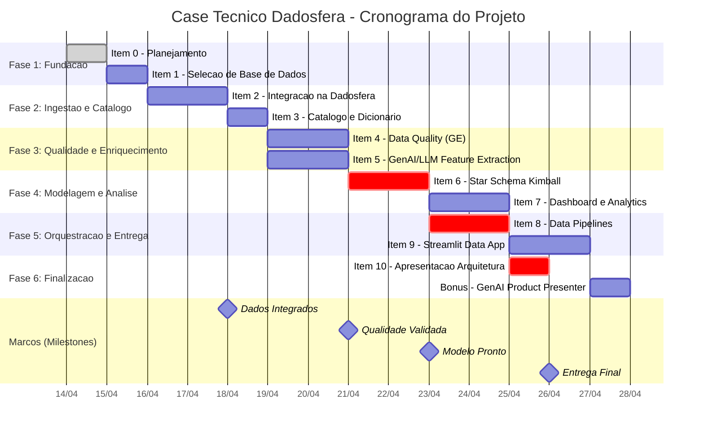

# Plano de Projeto -- Case Tecnico Dadosfera

**Titulo do Projeto:** Proof-of-Concept de Data Platform para E-Commerce  
**Metodologia:** PMBOK 7th Edition (adaptado para projetos de dados)  
**Candidato:** Leonardo Nunes  
**Data de Inicio:** 2026-04-14  
**Data de Termino Prevista:** 2026-05-02  
**Versao do Documento:** 1.0  
**Ultima Atualizacao:** 2026-04-13  

---

## Sumario Executivo

Este documento apresenta o planejamento completo do case tecnico Dadosfera, estruturado segundo as melhores praticas do PMBOK (Project Management Body of Knowledge). O projeto consiste na construcao de uma prova de conceito de Data Platform para uma empresa de e-commerce ficticia, utilizando a plataforma Dadosfera como nucleo central de coleta, processamento, exploracao, analise e inteligencia de dados.

O escopo abrange 11 itens obrigatorios (0 a 10) e 1 item bonus, totalizando 19 dias uteis de trabalho, executados por 1 Engenheiro de Dados em regime individual. O planejamento contempla WBS, cronograma Gantt, analise de riscos, estimativas de custo, alocacao de recursos, matriz de dependencias e identificacao do caminho critico.

---

## 1. Termo de Abertura do Projeto (Project Charter)

### 1.1 Justificativa

A Dadosfera e uma plataforma SaaS brasileira que unifica coleta, catalogo, processamento, analise e inteligencia de dados. O case tecnico avalia a capacidade do candidato de operar uma plataforma de dados moderna end-to-end, desde a selecao de fontes ate a entrega de valor analitico via dashboards e Data Apps.

### 1.2 Objetivos SMART

| # | Objetivo | Metrica | Meta |
|---|----------|---------|------|
| 1 | Integrar dados de e-commerce na Dadosfera | Datasets carregados com sucesso | >= 3 datasets |
| 2 | Catalogar e documentar todos os ativos de dados | Cobertura do dicionario de dados | 100% das colunas |
| 3 | Implementar validacoes de qualidade com Great Expectations | Expectativas executadas com sucesso | >= 15 regras |
| 4 | Extrair features com GenAI/LLM | Produtos processados via GPT-4 | >= 1.000 produtos |
| 5 | Modelar Star Schema Kimball | Tabelas fato/dimensao criadas | >= 1 fato + 4 dimensoes |
| 6 | Entregar dashboard analitico funcional | Visualizacoes interativas | >= 5 graficos |
| 7 | Construir Data App em Streamlit | Aplicacao deployada e funcional | 1 app publicado |
| 8 | Documentar arquitetura end-to-end | Apresentacao final | 1 documento/slides |

### 1.3 Premissas

- Acesso a conta de treinamento Dadosfera (tier gratuito/educacional).
- Acesso a API da OpenAI com credito suficiente para ~1.000 chamadas GPT-4.
- Disponibilidade do Google Colab no tier gratuito para notebooks auxiliares.
- Streamlit Community Cloud disponivel para deploy do Data App.
- Dados de e-commerce publicamente disponiveis (ex.: Brazilian E-Commerce -- Olist, Kaggle).

### 1.4 Restricoes

- Orcamento: Projeto individual sem investimento em infraestrutura paga.
- Tempo: Prazo fixo de 19 dias uteis.
- Equipe: 1 pessoa (o candidato).
- Plataforma: Funcionalidades limitadas ao tier de treinamento da Dadosfera.

### 1.5 Partes Interessadas (Stakeholders)

| Stakeholder | Papel | Interesse | Influencia |
|-------------|-------|-----------|------------|
| Avaliadores Dadosfera | Avaliadores tecnicos | Qualidade tecnica e completude | Alta |
| Candidato (Leonardo) | Executor e gerente do projeto | Demonstrar competencia | Alta |
| Comunidade Open Source | Beneficiario indireto | Reutilizacao do case | Baixa |

---

## 2. Estrutura Analitica do Projeto (WBS)

```
Case Tecnico Dadosfera (1.0)
|
|-- 1.0 INICIACAO E PLANEJAMENTO
|   |-- 1.1 Analise dos requisitos do case
|   |-- 1.2 Elaboracao do plano de projeto (este documento)
|   |-- 1.3 Configuracao do repositorio Git
|   |-- 1.4 Setup do ambiente (.env, requirements.txt)
|
|-- 2.0 SELECAO E AQUISICAO DE DADOS
|   |-- 2.1 Pesquisa de datasets de e-commerce
|   |-- 2.2 Avaliacao de qualidade e volume dos datasets
|   |-- 2.3 Download e armazenamento local
|   |-- 2.4 Documentacao da escolha (justificativa tecnica)
|
|-- 3.0 INTEGRACAO DE DADOS NA DADOSFERA
|   |-- 3.1 Configuracao do workspace na Dadosfera
|   |-- 3.2 Criacao de conectores (modulo Coletar)
|   |-- 3.3 Ingestao dos datasets (CSV/Parquet)
|   |-- 3.4 Validacao pos-ingestao (contagem de registros, schema)
|   |-- 3.5 Documentacao do processo de integracao
|
|-- 4.0 CATALOGO E DICIONARIO DE DADOS
|   |-- 4.1 Navegacao e configuracao do modulo Explorar
|   |-- 4.2 Catalogacao de tabelas e colunas
|   |-- 4.3 Criacao do dicionario de dados (descricoes, tipos, dominio)
|   |-- 4.4 Tagueamento e classificacao dos ativos
|
|-- 5.0 QUALIDADE DE DADOS
|   |-- 5.1 Instalacao e configuracao do Great Expectations
|   |-- 5.2 Profiling dos dados (analise exploratoria)
|   |-- 5.3 Definicao das Expectation Suites
|   |-- 5.4 Execucao dos checkpoints de validacao
|   |-- 5.5 Geracao de Data Docs (relatorios HTML)
|   |-- 5.6 Integracao dos resultados na documentacao
|
|-- 6.0 EXTRACAO DE FEATURES COM GenAI/LLM
|   |-- 6.1 Design dos prompts de extracao
|   |-- 6.2 Implementacao do pipeline de chamadas OpenAI
|   |-- 6.3 Processamento batch dos ~1.000 produtos
|   |-- 6.4 Validacao e curadoria dos resultados
|   |-- 6.5 Persistencia das features extraidas
|   |-- 6.6 Analise de custo e performance do pipeline LLM
|
|-- 7.0 MODELAGEM DE DADOS (KIMBALL STAR SCHEMA)
|   |-- 7.1 Identificacao dos processos de negocio
|   |-- 7.2 Definicao do grao (grain) de cada fato
|   |-- 7.3 Design das tabelas dimensao
|   |-- 7.4 Design das tabelas fato
|   |-- 7.5 Implementacao das transformacoes SQL/Python
|   |-- 7.6 Testes de integridade referencial
|   |-- 7.7 Documentacao do modelo (diagrama ER)
|
|-- 8.0 DASHBOARD E ANALYTICS
|   |-- 8.1 Definicao dos KPIs e metricas de negocio
|   |-- 8.2 Criacao das consultas analiticas
|   |-- 8.3 Design e construcao do dashboard (modulo Analisar)
|   |-- 8.4 Validacao cruzada dos numeros
|   |-- 8.5 Documentacao das visualizacoes
|
|-- 9.0 DATA PIPELINES
|   |-- 9.1 Design do fluxo de orquestracao
|   |-- 9.2 Implementacao dos pipelines (modulo Processar)
|   |-- 9.3 Configuracao de schedulers/triggers
|   |-- 9.4 Testes de execucao e idempotencia
|   |-- 9.5 Documentacao dos pipelines (DAG diagram)
|
|-- 10.0 DATA APP (STREAMLIT)
|   |-- 10.1 Design da interface e UX do app
|   |-- 10.2 Implementacao do backend (queries, cache)
|   |-- 10.3 Implementacao do frontend (componentes Streamlit)
|   |-- 10.4 Deploy no Streamlit Community Cloud
|   |-- 10.5 Testes de usabilidade e performance
|
|-- 11.0 APRESENTACAO DA ARQUITETURA
|   |-- 11.1 Elaboracao do diagrama de arquitetura end-to-end
|   |-- 11.2 Redacao do documento de decisoes tecnicas
|   |-- 11.3 Preparacao da apresentacao final
|   |-- 11.4 Revisao geral e polish
|
|-- 12.0 BONUS: GenAI Product Presenter
|   |-- 12.1 Design do agente de apresentacao de produtos
|   |-- 12.2 Implementacao com integracao OpenAI
|   |-- 12.3 Testes com produtos reais do dataset
|   |-- 12.4 Documentacao e demo
|
|-- 13.0 ENCERRAMENTO
|   |-- 13.1 Revisao final de todos os entregaveis
|   |-- 13.2 Commit final e organizacao do repositorio
|   |-- 13.3 Entrega do case
```

---

## 3. Cronograma do Projeto (Gantt Chart)

### 3.1 Cronograma em Formato Mermaid



### 3.2 Cronograma ASCII (Visao Alternativa)

```
Semana 1 (14-18/abr)    Semana 2 (21-25/abr)    Semana 3 (28/abr-02/mai)
Seg Ter Qua Qui Sex     Seg Ter Qua Qui Sex     Seg Ter Qua Qui Sex
 14  15  16  17  18      21  22  23  24  25      28  29  30  01  02
  |   |   |   |   |       |   |   |   |   |       |   |   |   |   |
  +---+                                            Item 0: Planejamento
  :   +---+                                        Item 1: Selecao BD
  :   :   +---+---+                                Item 2: Integracao
  :   :   :   :   +---+                            Item 3: Catalogo
  :   :   :   :   :   +---+---+                    Item 4: Data Quality
  :   :   :   :   :   +---+---+                    Item 5: GenAI/LLM
  :   :   :   :   :   :   :   +---+---+            Item 6: Star Schema
  :   :   :   :   :   :   :   :   :   +---+---+    Item 7: Dashboard
  :   :   :   :   :   :   :   :   :   +---+---+    Item 8: Pipelines
  :   :   :   :   :   :   :   :   :   :   :   +--  Item 9: Streamlit
  :   :   :   :   :   :   :   :   :   :   :   :    Item 10: Apresent.
  :   :   :   :   :   :   :   :   :   :   :   :    Bonus: GenAI Prod.
  |   |   |   |   |   |   |   |   |   |   |   |
  M0                  M1      M2      M3      M4

Legenda: M0=Kickoff  M1=Dados Integrados  M2=Qualidade OK  M3=Modelo OK  M4=Entrega
```

**Detalhamento por Dia:**

| Dia | Data | Item | Entregavel |
|-----|------|------|------------|
| D01 | 14/04 | Item 0 | Plano de projeto completo (este documento) |
| D02 | 15/04 | Item 1 | Documento de selecao de base de dados |
| D03 | 16/04 | Item 2 | Datasets integrados na Dadosfera (dia 1/2) |
| D04 | 17/04 | Item 2 | Validacao pos-ingestao concluida (dia 2/2) |
| D05 | 18/04 | Item 3 | Catalogo e dicionario de dados publicado |
| D06 | 21/04 | Item 4 / Item 5 | GE Suites definidas / Prompts desenhados |
| D07 | 22/04 | Item 4 / Item 5 | Data Docs gerados / Batch LLM concluido |
| D08 | 23/04 | Item 6 | Dimensoes e fato modeladas (dia 1/2) |
| D09 | 24/04 | Item 6 | Transformacoes implementadas e testadas (dia 2/2) |
| D10 | 25/04 | Item 7 / Item 8 | Dashboard v1 / Pipeline v1 (dia 1/2) |
| D11 | 28/04 | Item 7 / Item 8 | Dashboard final / Pipeline final (dia 2/2) |
| D12 | 29/04 | Item 9 | Streamlit app implementado (dia 1/2) |
| D13 | 30/04 | Item 9 | Streamlit app deployado (dia 2/2) |
| D14 | 01/05 | Item 10 | Apresentacao da arquitetura finalizada |
| D15 | 02/05 | Bonus | GenAI Product Presenter implementado |

---

## 4. Matriz de Dependencias e Caminho Critico

### 4.1 Tabela de Predecessores

| ID | Item | Predecessores | Tipo de Dependencia |
|----|------|---------------|---------------------|
| 0 | Planejamento | -- | Inicio |
| 1 | Selecao de BD | 0 | Termino-Inicio (TI) |
| 2 | Integracao Dadosfera | 1 | TI |
| 3 | Catalogo e Dicionario | 2 | TI |
| 4 | Data Quality (GE) | 3 | TI |
| 5 | GenAI/LLM Features | 3 | TI |
| 6 | Star Schema Kimball | 4, 5 | TI (ambos) |
| 7 | Dashboard & Analytics | 6 | TI |
| 8 | Data Pipelines | 6 | TI |
| 9 | Streamlit Data App | 7 | TI |
| 10 | Apresentacao Arquitetura | 8, 9 | TI (ambos) |
| B | Bonus: GenAI Presenter | 5 | TI |

### 4.2 Diagrama de Rede (Metodo do Caminho Critico -- CPM)

```
                                                    +-------+
                                               +--->| It. 7 |---+
                                               |    |  2d   |   |
+-------+   +-------+   +-------+   +-------+  |    +-------+   |   +-------+   +--------+
| It. 0 |-->| It. 1 |-->| It. 2 |-->| It. 3 |--+                +-->| It. 9 |-->|        |
|  1d   |   |  1d   |   |  2d   |   |  1d   |  |                |   |  2d   |   |        |
+-------+   +-------+   +-------+   +-------+  |    +-------+   |   +-------+   | It. 10 |
                                        |       +--->| It. 4 |---+               |  1d    |
                                        |       |   |  2d   |   |   +-------+   |        |
                                        |       |   +-------+   +-->| It. 8 |-->|        |
                                        |       |                    |  2d   |   +--------+
                                        |       |   +-------+       +-------+
                                        +-------+-->| It. 5 |---+
                                                |   |  2d   |   |   +-------+
                                                |   +-------+   +-->| Bonus |
                                                |                    |  1d   |
                                                |                    +-------+
                                                |
                                                +--->| It. 6 |
                                                     |  2d   |
                                                     +-------+
                                                (depende de 4 E 5)
```

**Nota:** O Item 6 (Star Schema) depende da conclusao de AMBOS os Itens 4 e 5, pois o modelo dimensional incorpora as features extraidas por LLM e precisa dos dados validados pelo Great Expectations.

### 4.3 Caminho Critico

O caminho critico e a sequencia mais longa de atividades dependentes que determina a duracao minima do projeto.

**Caminho Critico Identificado:**

```
Item 0 (1d) --> Item 1 (1d) --> Item 2 (2d) --> Item 3 (1d) --> Item 4 (2d) -->
Item 6 (2d) --> Item 8 (2d) --> Item 10 (1d)

Duracao total do caminho critico: 12 dias uteis
```

**Caminhos Alternativos:**

| Caminho | Sequencia | Duracao | Folga |
|---------|-----------|---------|-------|
| **Critico** | 0 > 1 > 2 > 3 > 4 > 6 > 8 > 10 | **12 dias** | 0 dias |
| Alternativo A | 0 > 1 > 2 > 3 > 5 > 6 > 7 > 9 > 10 | 12 dias | 0 dias |
| Alternativo B | 0 > 1 > 2 > 3 > 4 > 6 > 7 > 9 > 10 | 12 dias | 0 dias |
| Bonus | 0 > 1 > 2 > 3 > 5 > Bonus | 8 dias | 4 dias |

**Observacao Critica:** Os Itens 4 e 5 podem ser executados em paralelo (ambos dependem apenas do Item 3). Esta e a principal oportunidade de compressao do cronograma. Como sao executados pelo mesmo recurso, o paralelismo real implica alternancia de contexto (time-slicing), alocando manha para um e tarde para outro.

### 4.4 Matriz de Dependencias Cruzadas

```
           De \ Para  |  0  |  1  |  2  |  3  |  4  |  5  |  6  |  7  |  8  |  9  | 10  |  B  |
         -------------|-----|-----|-----|-----|-----|-----|-----|-----|-----|-----|-----|-----|
         Item 0       |  -  | TI  |     |     |     |     |     |     |     |     |     |     |
         Item 1       |     |  -  | TI  |     |     |     |     |     |     |     |     |     |
         Item 2       |     |     |  -  | TI  |     |     |     |     |     |     |     |     |
         Item 3       |     |     |     |  -  | TI  | TI  |     |     |     |     |     |     |
         Item 4       |     |     |     |     |  -  |     | TI  |     |     |     |     |     |
         Item 5       |     |     |     |     |     |  -  | TI  |     |     |     |     | TI  |
         Item 6       |     |     |     |     |     |     |  -  | TI  | TI  |     |     |     |
         Item 7       |     |     |     |     |     |     |     |  -  |     | TI  |     |     |
         Item 8       |     |     |     |     |     |     |     |     |  -  |     | TI  |     |
         Item 9       |     |     |     |     |     |     |     |     |     |  -  | TI  |     |
         Item 10      |     |     |     |     |     |     |     |     |     |     |  -  |     |
         Bonus        |     |     |     |     |     |     |     |     |     |     |     |  -  |

Legenda: TI = Termino-Inicio (Finish-to-Start)
```

---

## 5. Analise de Riscos

### 5.1 Registro de Riscos (Risk Register)

| ID | Categoria | Risco | Probabilidade | Impacto | Severidade | Estrategia | Plano de Mitigacao |
|----|-----------|-------|---------------|---------|------------|------------|--------------------|
| R01 | Tecnico | Funcionalidades Enterprise-only na Dadosfera indisponiveis no tier de treinamento | Alta | Alto | **CRITICO** | Mitigar | Identificar limitacoes no D01; documentar workarounds; usar notebooks locais como fallback para processamento |
| R02 | Tecnico | API da Dadosfera (Maestro) instavel ou com rate limiting | Media | Alto | **ALTO** | Mitigar | Implementar retry com backoff exponencial; cachear resultados intermediarios; ter scripts de ingestao manual como backup |
| R03 | Dados | Dataset de e-commerce com qualidade insuficiente (valores nulos, inconsistencias) | Media | Medio | MEDIO | Aceitar | Tratar na fase de Data Quality (Item 4); selecionar dataset maduro como Olist (Kaggle) que e bem documentado |
| R04 | Tecnico | Custo de API OpenAI excede o orcamento para 1.000 produtos | Baixa | Medio | MEDIO | Mitigar | Usar GPT-4o-mini como alternativa mais barata; implementar batching; estimar custo antes do processamento completo |
| R05 | Cronograma | Atraso em Itens 4/5 (paralelos) impacta cascata no Star Schema | Media | Alto | **ALTO** | Mitigar | Priorizar Item 4 (caminho critico); se necessario, reduzir escopo do Item 5 para 500 produtos |
| R06 | Tecnico | Google Colab desconecta durante processamento batch LLM | Media | Baixo | BAIXO | Aceitar | Implementar checkpointing; salvar progresso a cada 100 produtos; usar scripts locais como fallback |
| R07 | Tecnico | Streamlit Community Cloud fora do ar no dia do deploy | Baixa | Medio | MEDIO | Transferir | Preparar deploy alternativo via Hugging Face Spaces ou screenshot/video da app rodando localmente |
| R08 | Cronograma | Subestimacao da complexidade do Star Schema | Media | Alto | **ALTO** | Mitigar | Pre-definir o modelo conceitual no planejamento; limitar a 1 fato + 4 dimensoes; usar templates |
| R09 | Dados | Volume de dados insuficiente para demonstrar valor analitico | Baixa | Medio | MEDIO | Evitar | Selecionar dataset com minimo 100K registros transacionais; validar no Item 1 |
| R10 | Tecnico | Incompatibilidade entre Great Expectations e formato de dados na Dadosfera | Media | Medio | MEDIO | Mitigar | Executar GE localmente sobre export dos dados; documentar processo de integracao |
| R11 | Qualidade | Resultados do LLM inconsistentes ou com alucinacoes | Media | Medio | MEDIO | Mitigar | Validar amostra de 50 produtos manualmente; definir schema Pydantic para output; implementar retry para falhas |
| R12 | Cronograma | Feriado ou indisponibilidade pessoal nao planejada | Baixa | Medio | MEDIO | Aceitar | Buffer de 3 dias uteis entre conclusao planejada e deadline real; bonus pode ser sacrificado |

### 5.2 Matriz de Risco (Probabilidade x Impacto)

```
                         IMPACTO
                   Baixo     Medio      Alto
                 +----------+----------+----------+
       Alta      |          |          | R01      |
                 |          |          |          |
  P    +----------+----------+----------+----------+
  R    Media     | R06      | R03,R10  | R02,R05  |
  O              |          | R11      | R08      |
  B    +----------+----------+----------+----------+
  A    Baixa     |          | R04,R07  |          |
  B              |          | R09,R12  |          |
       +----------+----------+----------+----------+

  LEGENDA:
  Quadrante superior-direito = ZONA CRITICA (acao imediata)
  Quadrante central          = ZONA DE ATENCAO (monitoramento ativo)
  Quadrante inferior-esquerdo = ZONA ACEITAVEL (monitoramento passivo)
```

### 5.3 Plano de Contingencia por Severidade

**Riscos CRITICOS (acao imediata no D01):**

- **R01 -- Features Enterprise-only:** No primeiro dia de acesso a Dadosfera, mapear TODAS as funcionalidades disponiveis no tier de treinamento. Documentar gaps. Para cada gap, definir workaround (notebook local, script Python, ferramenta open-source equivalente). Comunicar proativamente na documentacao quais funcionalidades foram simuladas e por que.

**Riscos ALTOS (monitoramento diario):**

- **R02 -- API instavel:** Implementar wrapper de API com circuit breaker pattern. Cachear todas as respostas. Se a API falhar por mais de 4 horas, pivotar para upload manual via interface web.
- **R05 -- Atraso nos Itens 4/5:** Se ate o D06 (meio-dia) o Item 4 nao tiver pelo menos 50% das suites definidas, sacrificar complexidade do Item 5 (reduzir para 300 produtos).
- **R08 -- Complexidade Star Schema:** Comecar com modelo conceitual simplificado (1 fato orders + dimensoes: customer, product, seller, date). Adicionar complexidade apenas se houver folga no cronograma.

---

## 6. Estimativa de Custos

### 6.1 Orcamento Detalhado

| Categoria | Recurso | Unidade | Quantidade | Custo Unit. (USD) | Custo Total (USD) | Custo Total (BRL) |
|-----------|---------|---------|------------|-------------------|--------------------|--------------------|
| Plataforma | Dadosfera (conta treinamento) | Licenca | 1 | 0.00 | **0.00** | 0.00 |
| Plataforma | Google Colab (tier gratuito) | Licenca | 1 | 0.00 | **0.00** | 0.00 |
| Plataforma | Streamlit Community Cloud | Licenca | 1 | 0.00 | **0.00** | 0.00 |
| Plataforma | GitHub (repositorio publico) | Licenca | 1 | 0.00 | **0.00** | 0.00 |
| API | OpenAI GPT-4o-mini (Item 5) | 1K tokens input | ~500 | 0.00015 | **0.08** | 0.45 |
| API | OpenAI GPT-4o-mini (Item 5) | 1K tokens output | ~200 | 0.0006 | **0.12** | 0.68 |
| API | OpenAI GPT-4o (Bonus) | 1K tokens input | ~100 | 0.0025 | **0.25** | 1.43 |
| API | OpenAI GPT-4o (Bonus) | 1K tokens output | ~50 | 0.01 | **0.50** | 2.86 |
| Infra | Armazenamento local (disco) | GB | 2 | 0.00 | **0.00** | 0.00 |
| Humano | Engenheiro de Dados (candidato) | Dia | 15 | 0.00* | **0.00*** | 0.00* |
| | | | | **TOTAL** | **~0.95** | **~5.42** |

*Nota: O custo de mao de obra nao e contabilizado pois trata-se de um case tecnico avaliativo.*

### 6.2 Cenarios de Custo OpenAI

| Cenario | Modelo | Produtos | Custo Estimado (USD) |
|---------|--------|----------|----------------------|
| Economico | GPT-4o-mini | 1.000 | ~0.20 |
| Padrao | GPT-4o | 1.000 | ~2.50 |
| Premium | GPT-4 (legacy) | 1.000 | ~15.00 |
| Bonus incluso | GPT-4o + GPT-4o-mini | 1.000 + 100 | ~3.25 |

**Recomendacao:** Utilizar GPT-4o-mini para o processamento em batch (Item 5) por oferecer a melhor relacao custo-beneficio, e reservar GPT-4o para o Bonus (Product Presenter) onde a qualidade de geracao e mais visivel.

### 6.3 Reserva de Contingencia

| Tipo | Percentual | Valor (USD) |
|------|-----------|-------------|
| Reserva de contingencia (riscos conhecidos) | 50% | 0.48 |
| Reserva gerencial (riscos desconhecidos) | 20% | 0.19 |
| **Orcamento total com reservas** | | **~1.62** |

---

## 7. Alocacao de Recursos

### 7.1 Recurso Humano

| Recurso | Papel | Disponibilidade | Alocacao |
|---------|-------|-----------------|----------|
| Leonardo Nunes | Engenheiro de Dados / Gerente de Projeto | 100% | 8h/dia, 15 dias uteis |

### 7.2 Stack Tecnologico

| Camada | Ferramenta | Versao | Finalidade | Item(ns) |
|--------|------------|--------|------------|----------|
| Plataforma de Dados | Dadosfera | SaaS | Coleta, catalogo, processamento, analise | 2,3,7,8 |
| Linguagem | Python | 3.11+ | Scripts, notebooks, Data App | Todos |
| Qualidade de Dados | Great Expectations | >= 0.18 | Validacao, profiling, Data Docs | 4 |
| GenAI/LLM | OpenAI API | v1+ | Extracao de features | 5, Bonus |
| Modelagem | SQL + Python | -- | Transformacoes Kimball | 6 |
| Visualizacao | Plotly / Dadosfera Analytics | -- | Dashboards interativos | 7 |
| Data App | Streamlit | >= 1.28 | Aplicacao web interativa | 9 |
| Notebooks | Google Colab / Jupyter | -- | Desenvolvimento e experimentacao | 4, 5, 6 |
| Validacao de Schemas | Pydantic | >= 2.0 | Validacao de output do LLM | 5 |
| Versionamento | Git / GitHub | -- | Controle de versao | Todos |
| Dados | pandas / PyArrow | -- | Manipulacao de dados | Todos |

### 7.3 Mapa de Utilizacao de Recursos por Dia

```
Recurso / Dia      D01  D02  D03  D04  D05  D06  D07  D08  D09  D10  D11  D12  D13  D14  D15
                   14/4 15/4 16/4 17/4 18/4 21/4 22/4 23/4 24/4 25/4 28/4 29/4 30/4 01/5 02/5
--------------------------------------------------------------------------------------------------
Dadosfera           .    .   ███  ███  ███   .    .    .    .   ███  ███   .    .    .    .
Python             ██   ██   ██   ██   ██   ███  ███  ███  ███  ██   ██  ███  ███  ██   ██
Great Expectations  .    .    .    .    .   ███  ███   .    .    .    .    .    .    .    .
OpenAI API          .    .    .    .    .   ███  ███   .    .    .    .    .    .    .   ███
Streamlit           .    .    .    .    .    .    .    .    .    .    .   ███  ███   .    .
Google Colab        .    .    .    .    .   ██   ██   ██   ██    .    .    .    .    .    .

Legenda: ███ = Uso intensivo  ██ = Uso moderado  . = Nao utilizado
```

---

## 8. Plano de Qualidade

### 8.1 Criterios de Aceitacao por Entregavel

| Item | Entregavel | Criterio de Aceitacao | Metodo de Verificacao |
|------|------------|----------------------|-----------------------|
| 0 | Plano de projeto | Cobre todos os 10 itens + bonus com WBS, Gantt, riscos | Checklist PMBOK |
| 1 | Documento de selecao | Justificativa tecnica com >= 3 criterios comparativos | Revisao de pares |
| 2 | Dados integrados | >= 3 datasets carregados; contagem bate com fonte | Query de validacao |
| 3 | Catalogo completo | 100% das colunas com descricao e tipo documentado | Auditoria do catalogo |
| 4 | Data Quality report | >= 15 expectativas; Data Docs HTML gerado | Execucao do checkpoint |
| 5 | Features LLM | >= 1.000 produtos processados; schema validado | Validacao Pydantic |
| 6 | Star Schema | >= 1 fato + 4 dimensoes; integridade referencial | Testes SQL |
| 7 | Dashboard | >= 5 visualizacoes; KPIs calculados corretamente | Validacao cruzada |
| 8 | Pipelines | Execucao end-to-end bem-sucedida; idempotencia | Re-execucao do pipeline |
| 9 | Data App | App acessivel publicamente; responsivo; funcional | Teste de usabilidade |
| 10 | Apresentacao | Diagrama de arquitetura; decisoes tecnicas documentadas | Auto-revisao |
| B | GenAI Presenter | Agente funcional com demo de >= 3 produtos | Teste com dados reais |

### 8.2 Definition of Done (DoD)

Cada item so sera considerado concluido quando atender TODOS os criterios abaixo:

1. Codigo/configuracao commitado no repositorio Git
2. Documentacao do item escrita (notebook ou markdown)
3. Screenshot ou evidencia de funcionamento capturada
4. Criterio de aceitacao especifico validado
5. Nenhum erro critico pendente

---

## 9. Plano de Comunicacao

### 9.1 Artefatos de Comunicacao

| Artefato | Formato | Frequencia | Destinatario |
|----------|---------|------------|--------------|
| Commits Git | Mensagens convencionais | A cada entregavel | Avaliadores |
| README.md do repositorio | Markdown | Atualizado a cada fase | Avaliadores |
| Notebooks documentados | .ipynb com markdown | Por item | Avaliadores |
| Apresentacao final (Item 10) | PDF / HTML | Entrega unica | Avaliadores |
| Registro de decisoes tecnicas | ADR Markdown | Conforme necessario | Auto-referencia |

### 9.2 Estrutura de Diretorios do Repositorio

```
case-dadosfera/
|-- docs/
|   |-- 00_project_plan.md          <-- Este documento
|   |-- 01_database_selection.md
|   |-- 02_data_integration.md
|   |-- 03_data_catalog.md
|   |-- 04_data_quality.md
|   |-- 05_genai_features.md
|   |-- 06_star_schema.md
|   |-- 07_dashboard.md
|   |-- 08_data_pipelines.md
|   |-- 09_streamlit_app.md
|   |-- 10_architecture.md
|   |-- bonus_genai_presenter.md
|   |-- adr/                        <-- Architecture Decision Records
|   |   |-- 001_dataset_selection.md
|   |   |-- 002_llm_model_choice.md
|   |   |-- 003_star_schema_grain.md
|   |   +-- ...
|   +-- assets/                     <-- Diagramas e imagens
|
|-- notebooks/
|   |-- 01_exploratory_analysis.ipynb
|   |-- 04_data_quality_ge.ipynb
|   |-- 05_genai_feature_extraction.ipynb
|   |-- 06_star_schema_transformations.ipynb
|   +-- bonus_product_presenter.ipynb
|
|-- src/
|   |-- data_quality/               <-- Great Expectations configs
|   |-- pipelines/                  <-- Pipeline scripts
|   |-- models/                     <-- Modelos dimensionais (SQL/Python)
|   +-- streamlit_app/              <-- Codigo do Data App
|       |-- app.py
|       |-- pages/
|       +-- requirements.txt
|
|-- data/                           <-- (gitignored) Dados brutos
|-- .env.example
|-- .gitignore
|-- requirements.txt
+-- README.md
```

---

## 10. Metricas de Desempenho do Projeto (KPIs)

### 10.1 Earned Value Management (EVM) Simplificado

| Metrica | Formula | Meta |
|---------|---------|------|
| SPI (Schedule Performance Index) | EV / PV | >= 1.0 |
| CPI (Cost Performance Index) | EV / AC | >= 1.0 (custo ~zero) |
| Percentual de conclusao | Itens concluidos / Total | 100% (11/11 + bonus) |
| Qualidade | Criterios de aceitacao atendidos / Total | >= 90% |

### 10.2 Checkpoints de Monitoramento

| Checkpoint | Data | Entregaveis Esperados | % Concluido |
|------------|------|----------------------|-------------|
| CP1 | 18/04 (Sexta S1) | Itens 0, 1, 2, 3 concluidos | 36% |
| CP2 | 22/04 (Terca S2) | Itens 4, 5 concluidos | 55% |
| CP3 | 24/04 (Quinta S2) | Item 6 concluido | 64% |
| CP4 | 28/04 (Segunda S3) | Itens 7, 8 concluidos | 82% |
| CP5 | 30/04 (Quarta S3) | Item 9 concluido | 91% |
| CP6 | 02/05 (Sexta S3) | Itens 10 + Bonus concluidos | 100% |

---

## 11. Licoes Aprendidas (Framework)

Ao final de cada fase, registrar:

| Pergunta | Resposta |
|----------|----------|
| O que funcionou bem? | _(a preencher durante execucao)_ |
| O que pode ser melhorado? | _(a preencher durante execucao)_ |
| Que riscos se materializaram? | _(a preencher durante execucao)_ |
| Que riscos nao previstos surgiram? | _(a preencher durante execucao)_ |
| Recomendacoes para projetos futuros? | _(a preencher durante execucao)_ |

---

## 12. Criterios de Encerramento do Projeto

O projeto sera considerado concluido quando:

- [ ] Todos os 11 itens (0-10) entregues com criterios de aceitacao atendidos
- [ ] Bonus implementado (desejavel, nao obrigatorio)
- [ ] Repositorio Git organizado conforme estrutura definida
- [ ] README.md do repositorio atualizado com instrucoes de navegacao
- [ ] Apresentacao da arquitetura (Item 10) finalizada
- [ ] Todos os notebooks executaveis sem erros
- [ ] Data App (Streamlit) acessivel publicamente
- [ ] Documentacao completa de todos os itens

---

## Anexo A: Glossario PMBOK

| Termo | Definicao |
|-------|-----------|
| **WBS** | Work Breakdown Structure -- decomposicao hierarquica do escopo |
| **CPM** | Critical Path Method -- sequencia mais longa de atividades dependentes |
| **TI** | Termino-Inicio (Finish-to-Start) -- tipo de dependencia entre atividades |
| **EVM** | Earned Value Management -- metodologia de medicao de desempenho |
| **SPI** | Schedule Performance Index -- indicador de desempenho de prazo |
| **ADR** | Architecture Decision Record -- registro de decisao arquitetural |
| **DoD** | Definition of Done -- criterios para considerar um item concluido |
| **Star Schema** | Modelo dimensional Kimball com tabelas fato e dimensao |
| **Data Docs** | Relatorios HTML gerados pelo Great Expectations |

## Anexo B: Referencias

| Referencia | Descricao |
|------------|-----------|
| PMBOK Guide, 7th Edition | Project Management Body of Knowledge |
| Kimball, R. -- The Data Warehouse Toolkit | Referencia para modelagem dimensional |
| Great Expectations Documentation | Framework de validacao de dados |
| Dadosfera Documentation | Documentacao oficial da plataforma |
| OpenAI API Pricing | Tabela de precos da API OpenAI |

---

*Documento elaborado seguindo as praticas do PMBOK 7th Edition, adaptado para projetos de engenharia de dados em contexto de prova tecnica.*

*Plano de Projeto v1.0 -- Abril 2026*
