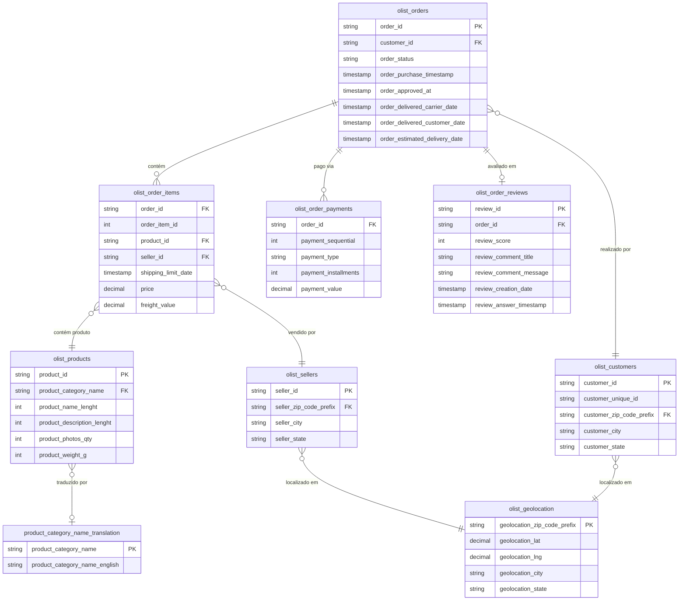

# Seleção de Datasets — Plataforma de Dados E-Commerce

> **Caso Técnico:** Dadosfera Data Platform
> **Documento:** 01 — Seleção de Datasets e Modelagem de Domínio
> **Data:** Abril de 2026
> **Versão:** 1.0

---

## 1. Visão Geral

Este documento justifica a escolha dos datasets utilizados na construção da plataforma de dados e-commerce, descreve a estrutura de cada tabela e apresenta o diagrama de relacionamento entre as entidades do domínio.

A arquitetura de dados foi projetada para suportar dois eixos analíticos principais:

1. **Análise de Vendas** — comportamento de pedidos, receita, produtos e logística
2. **Análise de Satisfação do Cliente** — avaliações, NPS implícito, qualidade da entrega

---

## 2. Dataset Primário — Olist Brazilian E-Commerce (Kaggle)

### 2.1 Identificação

| Atributo | Detalhe |
|----------|---------|
| **Nome** | Brazilian E-Commerce Public Dataset by Olist |
| **Origem** | Kaggle — Olist + André Sionek |
| **URL** | https://www.kaggle.com/datasets/olistbr/brazilian-ecommerce |
| **Cobertura temporal** | Setembro de 2016 a Outubro de 2018 |
| **Volume** | ~100.000 pedidos, ~9 tabelas relacionais |
| **Licença** | CC BY-NC-SA 4.0 |
| **Formato** | CSV (UTF-8) |

### 2.2 Justificativa de Escolha

O dataset da Olist foi selecionado por três razões determinantes:

**Realismo comercial:** os dados são anonimizados, mas provêm de transações reais de um marketplace brasileiro de grande escala. Isso confere validade de negócio às análises, diferentemente de datasets sintéticos que carecem de distribuições naturais de outliers, sazonalidade e comportamentos atípicos.

**Cobertura do domínio e-commerce:** o schema cobre todas as entidades centrais de um e-commerce — pedidos, itens, pagamentos, avaliações, clientes, produtos, vendedores e geolocalização. Essa completude permite demonstrar modelagem dimensional completa (star schema) com múltiplas dimensões conformadas.

**Adequação para engenharia de dados:** com 100 mil registros, o volume é suficiente para demonstrar pipelines de ingestão, transformação e modelagem sem exigir infraestrutura de big data, tornando o ambiente reproduzível em Dadosfera sem custos proibitivos.

### 2.3 Tabelas e Descrição

#### `olist_orders`
Tabela central do domínio. Cada linha representa um pedido único, com status do ciclo de vida e timestamps de cada etapa.

| Coluna | Tipo | Descrição |
|--------|------|-----------|
| `order_id` | string | Identificador único do pedido (chave natural) |
| `customer_id` | string | Referência ao cliente (anonimizado) |
| `order_status` | string | Status: created, approved, processing, shipped, delivered, canceled, unavailable |
| `order_purchase_timestamp` | timestamp | Momento da compra |
| `order_approved_at` | timestamp | Momento da aprovação do pagamento |
| `order_delivered_carrier_date` | timestamp | Entrega para a transportadora |
| `order_delivered_customer_date` | timestamp | Entrega ao cliente final |
| `order_estimated_delivery_date` | timestamp | Data estimada de entrega prometida |

#### `olist_order_items`
Granularidade de item de pedido. Um pedido pode ter múltiplos itens (produtos diferentes ou repetidos). Esta tabela é a fonte das métricas de receita.

| Coluna | Tipo | Descrição |
|--------|------|-----------|
| `order_id` | string | FK para `olist_orders` |
| `order_item_id` | int | Sequência do item dentro do pedido |
| `product_id` | string | FK para `olist_products` |
| `seller_id` | string | FK para `olist_sellers` |
| `shipping_limit_date` | timestamp | Prazo máximo para o vendedor despachar |
| `price` | decimal | Preço unitário do produto |
| `freight_value` | decimal | Valor do frete por item |

#### `olist_order_payments`
Registros de pagamento por pedido. Um pedido pode ter múltiplos métodos de pagamento (ex.: cartão + voucher). Relacionamento 1:N com pedidos.

| Coluna | Tipo | Descrição |
|--------|------|-----------|
| `order_id` | string | FK para `olist_orders` |
| `payment_sequential` | int | Sequência do pagamento (1 = primeiro método) |
| `payment_type` | string | Tipo: credit_card, boleto, voucher, debit_card |
| `payment_installments` | int | Número de parcelas |
| `payment_value` | decimal | Valor pago por este método |

#### `olist_order_reviews`
Avaliações dos clientes após a entrega. Base para análise de satisfação e NPS.

| Coluna | Tipo | Descrição |
|--------|------|-----------|
| `review_id` | string | Identificador único da avaliação |
| `order_id` | string | FK para `olist_orders` |
| `review_score` | int | Nota de 1 a 5 |
| `review_comment_title` | string | Título do comentário (opcional) |
| `review_comment_message` | string | Texto livre da avaliação (opcional) |
| `review_creation_date` | timestamp | Data de criação da pesquisa |
| `review_answer_timestamp` | timestamp | Data de resposta do cliente |

#### `olist_customers`
Dimensão de clientes. Cada `customer_id` em `olist_orders` é único por pedido — o `customer_unique_id` identifica o cliente físico ao longo do tempo.

| Coluna | Tipo | Descrição |
|--------|------|-----------|
| `customer_id` | string | Identificador por pedido (anonimizado) |
| `customer_unique_id` | string | Identificador real do cliente (para recorrência) |
| `customer_zip_code_prefix` | string | CEP (5 dígitos) |
| `customer_city` | string | Cidade do cliente |
| `customer_state` | string | UF do cliente |

#### `olist_products`
Catálogo de produtos. Contém atributos físicos e de categoria. Não há nome do produto (anonimizado); disponível via `product_category_name`.

| Coluna | Tipo | Descrição |
|--------|------|-----------|
| `product_id` | string | Identificador único do produto |
| `product_category_name` | string | Categoria em português |
| `product_name_lenght` | int | Comprimento do nome (proxy de detalhe) |
| `product_description_lenght` | int | Comprimento da descrição |
| `product_photos_qty` | int | Quantidade de fotos |
| `product_weight_g` | int | Peso em gramas |
| `product_length_cm` | int | Comprimento em cm |
| `product_height_cm` | int | Altura em cm |
| `product_width_cm` | int | Largura em cm |

#### `olist_sellers`
Dimensão de vendedores. Permite análise de performance por lojista e região de origem.

| Coluna | Tipo | Descrição |
|--------|------|-----------|
| `seller_id` | string | Identificador único do vendedor |
| `seller_zip_code_prefix` | string | CEP do vendedor |
| `seller_city` | string | Cidade do vendedor |
| `seller_state` | string | UF do vendedor |

#### `olist_geolocation`
Tabela de referência geográfica. Mapeia prefixos de CEP para coordenadas geográficas. Útil para análises de densidade logística e heatmaps.

| Coluna | Tipo | Descrição |
|--------|------|-----------|
| `geolocation_zip_code_prefix` | string | CEP (5 dígitos) |
| `geolocation_lat` | decimal | Latitude |
| `geolocation_lng` | decimal | Longitude |
| `geolocation_city` | string | Cidade |
| `geolocation_state` | string | UF |

#### `product_category_name_translation`
Tabela de tradução das categorias de produto do português para o inglês. Necessária para internacionalização dos dashboards.

| Coluna | Tipo | Descrição |
|--------|------|-----------|
| `product_category_name` | string | Nome em português |
| `product_category_name_english` | string | Nome em inglês |

---

## 3. Dataset Secundário — Amazon Product Data (GenAI)

### 3.1 Identificação

| Atributo | Detalhe |
|----------|---------|
| **Nome** | Amazon Product Data |
| **Origem** | Julian McAuley, UCSD |
| **URL** | https://jmcauley.ucsd.edu/data/amazon/ |
| **Formato** | JSON (por categoria) |
| **Conteúdo** | Descrições de produtos, reviews, metadados |
| **Uso no projeto** | Feature extraction via LLM (categorização, enriquecimento semântico) |

### 3.2 Justificativa de Escolha

O dataset da Olist anonimiza os nomes dos produtos, limitando análises semânticas. O Amazon Product Data foi selecionado como fonte complementar para demonstrar capacidades de processamento de texto não estruturado com LLMs, um diferencial técnico central da Dadosfera.

**Caso de uso específico:** extrair embeddings de descrições de produtos para:
- Classificar produtos sem categoria definida (zero-shot classification)
- Sugerir categorias similares para novos produtos
- Calcular similaridade semântica entre produtos para recomendação

**Adequação técnica:** os dados estão em formato JSON com campo `description` de texto livre, formato ideal para pipelines de extração de features com modelos de linguagem (OpenAI ou modelos open-source via HuggingFace).

### 3.3 Estrutura JSON de Exemplo

```json
{
  "asin": "B000JQ0JNS",
  "title": "Monopoly Board Game",
  "description": "The Monopoly game is a real estate trading game...",
  "categories": [["Toys & Games", "Games", "Board Games"]],
  "price": 19.99,
  "brand": "Hasbro",
  "salesRank": {"Toys & Games": 1234}
}
```

### 3.4 Pipeline de Integração

```
Amazon Product JSON
       |
       v
[Extração de embeddings via LLM]
       |
       v
[Armazenamento em tabela de features]
       |
       v
product_embeddings (product_id, embedding_vector, extracted_category, confidence_score)
       |
       v
[JOIN com olist_products via category_name]
```

---

## 4. Diagrama de Relacionamento — Dataset Olist

### 4.1 Diagrama Entidade-Relacionamento (Mermaid)



### 4.2 Cardinalidades Relevantes

| Relacionamento | Cardinalidade | Observação |
|----------------|---------------|------------|
| `olist_orders` → `olist_customers` | N:1 | Cada pedido tem exatamente 1 cliente |
| `olist_orders` → `olist_order_items` | 1:N | Um pedido pode ter múltiplos itens |
| `olist_orders` → `olist_order_payments` | 1:N | Um pedido pode ter múltiplos métodos de pagamento |
| `olist_orders` → `olist_order_reviews` | 1:0..1 | Nem todo pedido é avaliado |
| `olist_order_items` → `olist_products` | N:1 | Produto pode aparecer em múltiplos pedidos |
| `olist_order_items` → `olist_sellers` | N:1 | Vendedor pode vender múltiplos itens |
| `olist_customers` → `olist_geolocation` | N:1 | Via prefixo de CEP |

---

## 5. Alinhamento com a Narrativa E-Commerce

A combinação dos dois datasets cobre o ciclo completo de valor de uma plataforma e-commerce moderna:

| Fase do Ciclo | Dataset | Análise Viabilizada |
|---------------|---------|---------------------|
| Catálogo de Produtos | Olist Products + Amazon JSON | Enriquecimento de categorias via LLM |
| Jornada de Compra | Olist Orders + Items | Funil de conversão, abandono |
| Pagamentos | Olist Payments | Mix de métodos, parcelamento médio |
| Logística | Olist Orders (timestamps) + Geolocation | SLA de entrega, lead time por região |
| Pós-venda | Olist Reviews | NPS, CSAT, análise de sentimento |
| Vendedores | Olist Sellers | Ranking de performance, churn de lojistas |

---

## 6. Limitações Conhecidas

| Limitação | Impacto | Mitigação |
|-----------|---------|-----------|
| Produtos anonimizados (sem nome) | Impossibilita busca textual direta | Amazon Product Data preenche semanticamente |
| `olist_geolocation` tem duplicatas por CEP | Agregações incorretas sem deduplicação | `QUALIFY ROW_NUMBER() OVER (PARTITION BY zip_code_prefix)` |
| `customer_id` varia por pedido | Análise de recorrência requer `customer_unique_id` | Mapeado em `dim_customer` via chave natural |
| Reviews opcionais (~50% dos pedidos) | Viés de seleção nas análises de satisfação | Documentado nos dashboards com percentual de cobertura |
| Sem dados de estoque ou SKU | Impossibilita análise de disponibilidade | Fora do escopo deste caso |

---

**Confianca:** 0.95 | **Impacto:** Alto
**Fontes:** KB: data-modeling/concepts/dimensional-modeling.md | Kaggle Olist Dataset | UCSD Amazon Product Data
