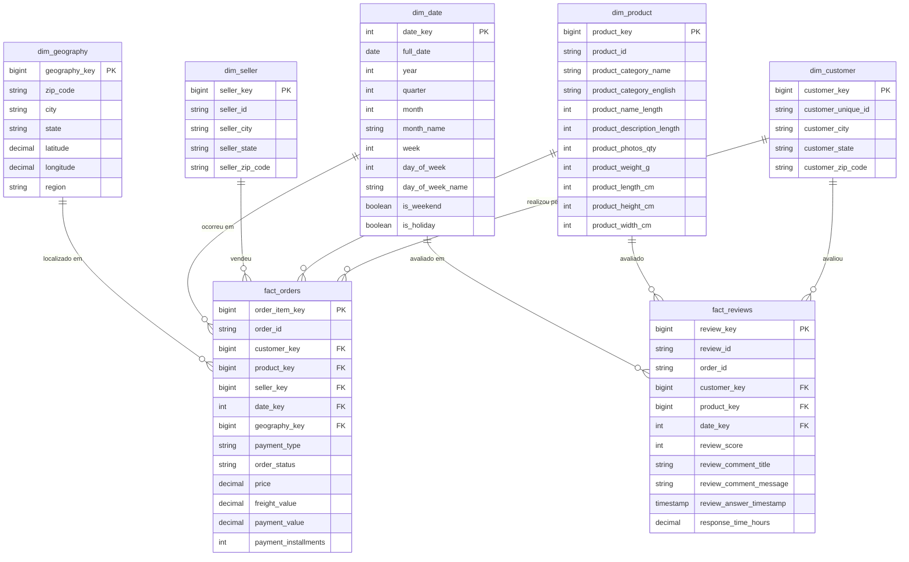

# Modelagem de Dados — Star Schema Kimball

> **Caso Técnico:** Dadosfera Data Platform
> **Documento:** 06 — Modelagem Dimensional (Kimball Star Schema)
> **Data:** Abril de 2026
> **Versão:** 1.0

---

## 1. Estrategia de Modelagem

### 1.1 Por que Kimball (Star Schema) e nao Data Vault?

A escolha entre Kimball e Data Vault é determinada pelo contexto do projeto, não por preferência técnica. Para este caso, o Star Schema é a escolha correta pelos seguintes motivos:

| Critério | Kimball (Star Schema) | Data Vault 2.0 |
|----------|-----------------------|----------------|
| **Numero de fontes** | 1 fonte (Olist CSV) | Ideal para 3+ fontes |
| **Time to insight** | Alto — tabelas prontas para BI | Médio/Baixo — requer camada de marts |
| **Complexidade de query** | Baixa — JOINs simples de estrela | Alta — Hub + Link + Satellite por entidade |
| **Historico de mudancas** | Desnecessário (dataset estático) | Essencial para cargas incrementais auditáveis |
| **Audiência** | Analistas de negócio, BI tools | Engenheiros, auditoria de dados |
| **Overhead de modelagem** | Baixo — ~10 tabelas | Alto — 3x mais tabelas (Hub/Link/Sat por entidade) |

**Conclusao:** o Data Vault seria over-engineering para um dataset estático com fonte única. O Kimball entrega valor imediato com SQL simples e compatibilidade nativa com qualquer ferramenta de BI (Metabase, Superset, Tableau, Power BI).

### 1.2 Arquitetura de Zonas (Medallion)

```
┌─────────────────────────────────────────────────────────────────┐
│  ZONE RAW (raw_zone)                                            │
│  Dados brutos dos CSVs — sem transformação, sem tipagem forte   │
│  Tabelas: raw_orders, raw_order_items, raw_payments, etc.       │
└──────────────────────────┬──────────────────────────────────────┘
                           │  Limpeza + Tipagem + Deduplicação
                           v
┌─────────────────────────────────────────────────────────────────┐
│  ZONE TRUSTED (trusted_zone)                                    │
│  Dados limpos e validados — schema enforced, PKs garantidas     │
│  Tabelas: stg_orders, stg_customers, stg_products, etc.         │
└──────────────────────────┬──────────────────────────────────────┘
                           │  Modelagem dimensional + Surrogate Keys
                           v
┌─────────────────────────────────────────────────────────────────┐
│  ZONE REFINED (refined_zone)                                    │
│  Star Schema — dimensoes e fatos prontos para consumo           │
│  Tabelas: dim_customer, dim_product, fact_orders, fact_reviews  │
└─────────────────────────────────────────────────────────────────┘
```

### 1.3 Fluxo de Dados Detalhado

```
CSV (Kaggle)
    │
    ├─► raw_zone.raw_orders              ─► trusted_zone.stg_orders
    ├─► raw_zone.raw_order_items         ─► trusted_zone.stg_order_items
    ├─► raw_zone.raw_order_payments      ─► trusted_zone.stg_order_payments
    ├─► raw_zone.raw_order_reviews       ─► trusted_zone.stg_order_reviews
    ├─► raw_zone.raw_customers           ─► trusted_zone.stg_customers
    ├─► raw_zone.raw_products            ─► trusted_zone.stg_products
    ├─► raw_zone.raw_sellers             ─► trusted_zone.stg_sellers
    ├─► raw_zone.raw_geolocation         ─► trusted_zone.stg_geolocation
    └─► raw_zone.raw_category_translation ─► trusted_zone.stg_category_translation

trusted_zone (staging)
    │
    ├─► refined_zone.dim_customer        (via stg_customers + stg_geolocation)
    ├─► refined_zone.dim_product         (via stg_products + stg_category_translation)
    ├─► refined_zone.dim_seller          (via stg_sellers + stg_geolocation)
    ├─► refined_zone.dim_date            (gerada por rotina de calendario)
    ├─► refined_zone.dim_geography       (via stg_geolocation deduplicada)
    ├─► refined_zone.fact_orders         (via stg_orders + stg_order_items + stg_payments)
    └─► refined_zone.fact_reviews        (via stg_order_reviews + fact_orders)
```

---

## 2. Definicao de Grao (Grain)

> "Definir o grao é a decisao mais importante na modelagem dimensional. Tudo o mais deriva dele." — Ralph Kimball

| Tabela Fato | Grao | O que representa uma linha? |
|-------------|------|-----------------------------|
| `fact_orders` | Um item de pedido | 1 produto vendido em 1 pedido, por 1 vendedor, com 1 pagamento agregado |
| `fact_reviews` | Uma avaliacao de pedido | 1 review submetida por 1 cliente para 1 pedido entregue |

**Nota sobre `fact_orders`:** A granularidade foi definida no nível de item de pedido (`order_item`), pois é o nível mais atômico que permite calcular receita por produto, por vendedor e por categoria. Métricas de pedido (total do pedido) são deriváveis por agregação (`SUM(price) GROUP BY order_id`).

**Nota sobre `fact_reviews`:** O grao é o nível de pedido (1 review por pedido), pois a fonte de dados Olist não associa reviews a itens individuais, apenas ao pedido completo.

---

## 3. Estrategia SCD (Slowly Changing Dimensions)

Para este caso, **SCD Tipo 1 (overwrite)** é adotado em todas as dimensões, pela seguinte razão:

**O dataset Olist é estático.** Os dados representam um período histórico fixo (2016–2018) e não sofrerão atualizações incrementais. Isso elimina a necessidade de rastrear versões históricas de registros dimensionais.

| Dimensao | SCD Tipo | Justificativa |
|----------|----------|---------------|
| `dim_customer` | Tipo 1 | Dataset estático; customer_state/city não muda retroativamente |
| `dim_product` | Tipo 1 | Catálogo fixo; sem histórico de alterações de categoria |
| `dim_seller` | Tipo 1 | Localização do vendedor não é rastreada historicamente |
| `dim_date` | Tipo 0 (fixo) | Dimensão de calendário é imutável por natureza |
| `dim_geography` | Tipo 0 (fixo) | Coordenadas geográficas são referência estática |

**Nota para ambientes de producao:** em um pipeline incremental com novos pedidos chegando diariamente, `dim_customer` seria SCD Tipo 2 para rastrear mudanças de estado/cidade do cliente ao longo do tempo, permitindo análises históricas corretas.

---

## 4. Visao 1 — Analise de Vendas (fact_orders)

### 4.1 Definicao das Dimensoes Conformadas

#### `dim_customer`
- **Grao:** Um cliente único (`customer_unique_id`)
- **Chave natural:** `customer_unique_id`
- **Chave surrogate:** `customer_key` (IDENTITY)
- **Atributos:** cidade, estado, CEP (anonimizado como prefixo)

#### `dim_product`
- **Grao:** Um produto único (`product_id`)
- **Chave natural:** `product_id`
- **Chave surrogate:** `product_key` (IDENTITY)
- **Atributos:** categoria (PT e EN), dimensões físicas, quantidade de fotos

#### `dim_seller`
- **Grao:** Um vendedor único (`seller_id`)
- **Chave natural:** `seller_id`
- **Chave surrogate:** `seller_key` (IDENTITY)
- **Atributos:** cidade, estado, CEP do vendedor

#### `dim_date`
- **Grao:** Um dia do calendário
- **Chave:** `date_key` no formato `YYYYMMDD` (INTEGER)
- **Atributos:** ano, trimestre, mês, semana, dia da semana, flag de fim de semana, flag de feriado
- **Nota:** dimensão de data é conformed — compartilhada entre `fact_orders` e `fact_reviews`

#### `dim_geography`
- **Grao:** Um prefixo de CEP único (após deduplicação)
- **Chave natural:** `zip_code_prefix`
- **Chave surrogate:** `geography_key` (IDENTITY)
- **Atributos:** cidade, estado, latitude, longitude, região macro (Norte, Nordeste, etc.)

### 4.2 Tabela Fato: `fact_orders`

**Grao:** Um item de pedido — a intersecao entre um pedido, um produto e um vendedor.

| Coluna | Tipo | Classificacao | Descricao |
|--------|------|---------------|-----------|
| `order_item_key` | BIGINT | Surrogate PK | Chave surrogate do registro |
| `order_id` | VARCHAR(50) | Dimensao Degenerada | ID do pedido (sem tabela própria) |
| `customer_key` | BIGINT | FK | Referência a `dim_customer` |
| `product_key` | BIGINT | FK | Referência a `dim_product` |
| `seller_key` | BIGINT | FK | Referência a `dim_seller` |
| `date_key` | INTEGER | FK | Referência a `dim_date` |
| `geography_key` | BIGINT | FK | Referência a `dim_geography` (do cliente) |
| `payment_type` | VARCHAR(20) | Atributo de fato | Tipo de pagamento principal |
| `order_status` | VARCHAR(20) | Atributo de fato | Status final do pedido |
| `price` | DECIMAL(12,2) | Medida aditiva | Preço do item |
| `freight_value` | DECIMAL(12,2) | Medida aditiva | Frete do item |
| `payment_value` | DECIMAL(12,2) | Medida aditiva | Valor pago (proporcional ao item) |
| `payment_installments` | INTEGER | Medida semi-aditiva | Numero de parcelas |

**Medidas aditivas:** `price`, `freight_value`, `payment_value` — podem ser somadas em qualquer dimensão.
**Medida semi-aditiva:** `payment_installments` — média faz sentido, soma não.

---

## 5. Visao 2 — Analise de Satisfacao (fact_reviews)

### 5.1 Tabela Fato: `fact_reviews`

**Grao:** Uma avaliacao submetida por um cliente para um pedido entregue.

| Coluna | Tipo | Classificacao | Descricao |
|--------|------|---------------|-----------|
| `review_key` | BIGINT | Surrogate PK | Chave surrogate do registro |
| `review_id` | VARCHAR(50) | Dimensao Degenerada | ID da avaliação (sem tabela própria) |
| `order_id` | VARCHAR(50) | Dimensao Degenerada | ID do pedido avaliado |
| `customer_key` | BIGINT | FK | Referência a `dim_customer` |
| `product_key` | BIGINT | FK | Referência ao produto principal do pedido |
| `date_key` | INTEGER | FK | Data de resposta da avaliação |
| `review_score` | INTEGER | Medida aditiva | Nota de 1 a 5 |
| `review_comment_title` | VARCHAR(100) | Atributo textual | Título do comentário |
| `review_comment_message` | VARCHAR(2000) | Atributo textual | Texto da avaliação |
| `review_answer_timestamp` | TIMESTAMP_NTZ | Atributo temporal | Momento exato da resposta |
| `response_time_hours` | DECIMAL(10,2) | Medida aditiva | Horas entre criação e resposta |

**Nota sobre `review_score`:** embora seja ordinal (1-5), calcular a média é uma prática aceita para NPS-like scoring em e-commerce. `AVG(review_score)` sobre qualquer dimensão produz resultados analiticamente válidos.

---

## 6. Diagrama ER — Star Schema (Mermaid)



---

## 7. Bus Matrix — Dimensoes Conformadas

A Bus Matrix documenta quais dimensões são compartilhadas entre os fatos. Dimensões conformadas garantem que análises cruzadas entre fatos são consistentes.

|  | `dim_date` | `dim_customer` | `dim_product` | `dim_seller` | `dim_geography` |
|--|:----------:|:--------------:|:-------------:|:------------:|:---------------:|
| `fact_orders` | X | X | X | X | X |
| `fact_reviews` | X | X | X | - | - |

**Dimensoes conformadas** (compartilhadas): `dim_date`, `dim_customer`, `dim_product`
**Dimensao exclusiva de fact_orders**: `dim_seller`, `dim_geography`

---

## 8. DDL Completo — Snowflake Dialect

O DDL completo com `CREATE SCHEMA`, `CREATE TABLE`, comentários por coluna, chaves primárias e referências de chaves estrangeiras (como comentários, dado que Snowflake não as enforça) está disponível em:

```
/sql/ddl/star_schema.sql
```

Os scripts seguem as convenções:
- Schemas separados por zona: `raw_zone`, `trusted_zone`, `refined_zone`
- `COMMENT ON COLUMN` para todas as colunas de dimensões e fatos
- Surrogate keys como `NUMBER AUTOINCREMENT` (equivalente Snowflake a `BIGINT IDENTITY`)
- `TIMESTAMP_NTZ` para timestamps sem timezone (padrão para dados históricos)
- `CLUSTER BY` nas tabelas fato para otimização de micro-partições

---

## 9. Regras de Qualidade por Tabela

| Tabela | Regra | Tipo |
|--------|-------|------|
| `fact_orders` | `price >= 0` | Constraint numérica |
| `fact_orders` | `freight_value >= 0` | Constraint numérica |
| `fact_orders` | `customer_key IS NOT NULL` | Not null |
| `fact_orders` | `date_key BETWEEN 20160101 AND 20181231` | Range temporal |
| `fact_reviews` | `review_score BETWEEN 1 AND 5` | Range de valores |
| `fact_reviews` | `response_time_hours >= 0` | Constraint numérica |
| `dim_customer` | `customer_unique_id IS NOT NULL` | Not null |
| `dim_date` | `date_key = CAST(TO_CHAR(full_date, 'YYYYMMDD') AS INT)` | Consistência de chave |
| `dim_geography` | `latitude BETWEEN -90 AND 90` | Range geográfico |
| `dim_geography` | `longitude BETWEEN -180 AND 180` | Range geográfico |

---

## 10. Linha Nula (Unknown Member Row)

Para cada dimensão, uma linha sentinela com `key = -1` é inserida para tratar chaves estrangeiras não encontradas (NULLs). Esta prática evita quebra de JOINs em ferramentas de BI.

```sql
-- Exemplo: dim_customer linha sentinela
INSERT INTO refined_zone.dim_customer (customer_key, customer_unique_id, customer_city, customer_state, customer_zip_code)
VALUES (-1, 'UNKNOWN', 'UNKNOWN', 'UNKNOWN', '00000');

-- Exemplo: dim_product linha sentinela
INSERT INTO refined_zone.dim_product (product_key, product_id, product_category_name, product_category_english)
VALUES (-1, 'UNKNOWN', 'UNKNOWN', 'UNKNOWN');
```

As chaves estrangeiras em `fact_orders` e `fact_reviews` devem referenciar `-1` onde o JOIN não encontrar correspondência, em vez de NULL.

---

**Confianca:** 0.95 | **Impacto:** Alto
**Fontes:** KB: data-modeling/concepts/dimensional-modeling.md | KB: data-modeling/patterns/star-schema.md | KB: data-modeling/concepts/scd-types.md
