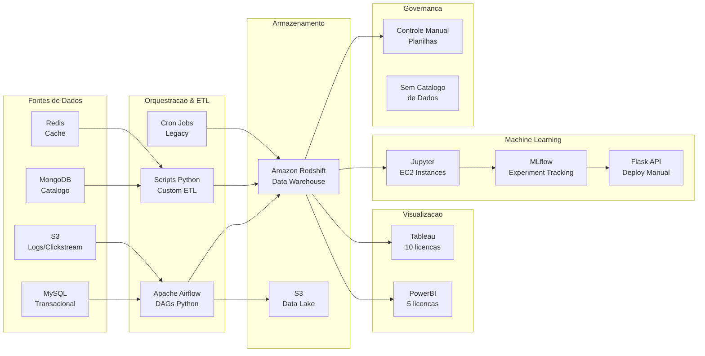
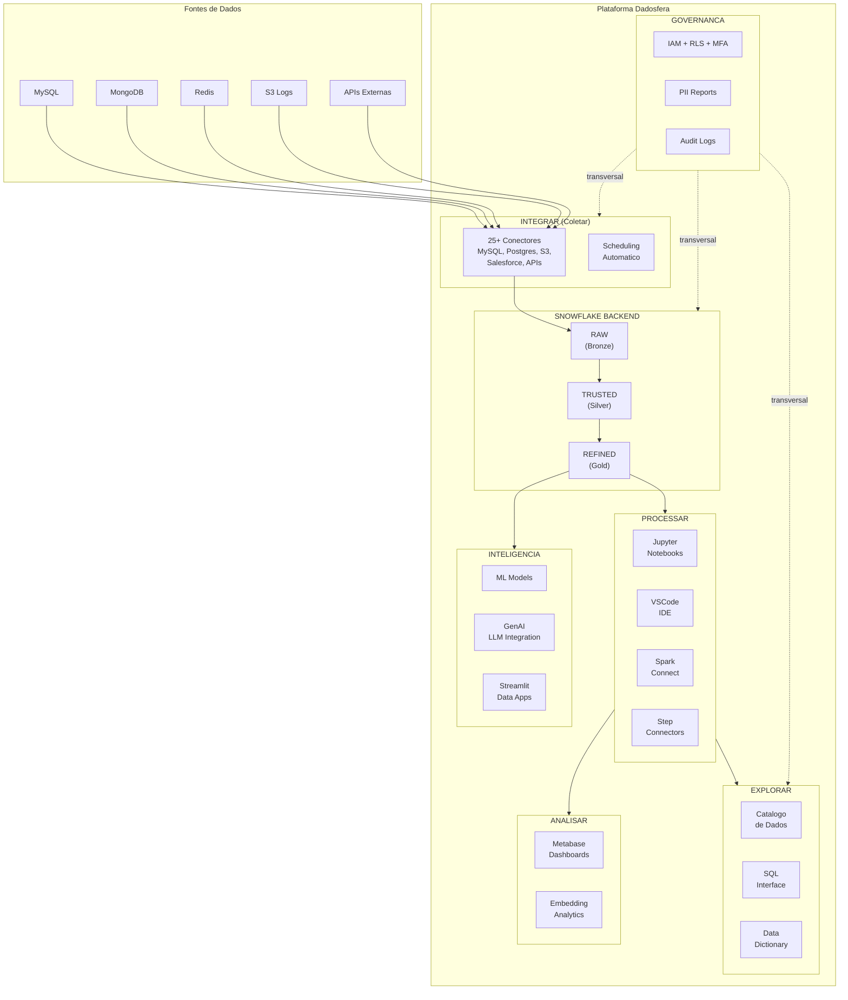
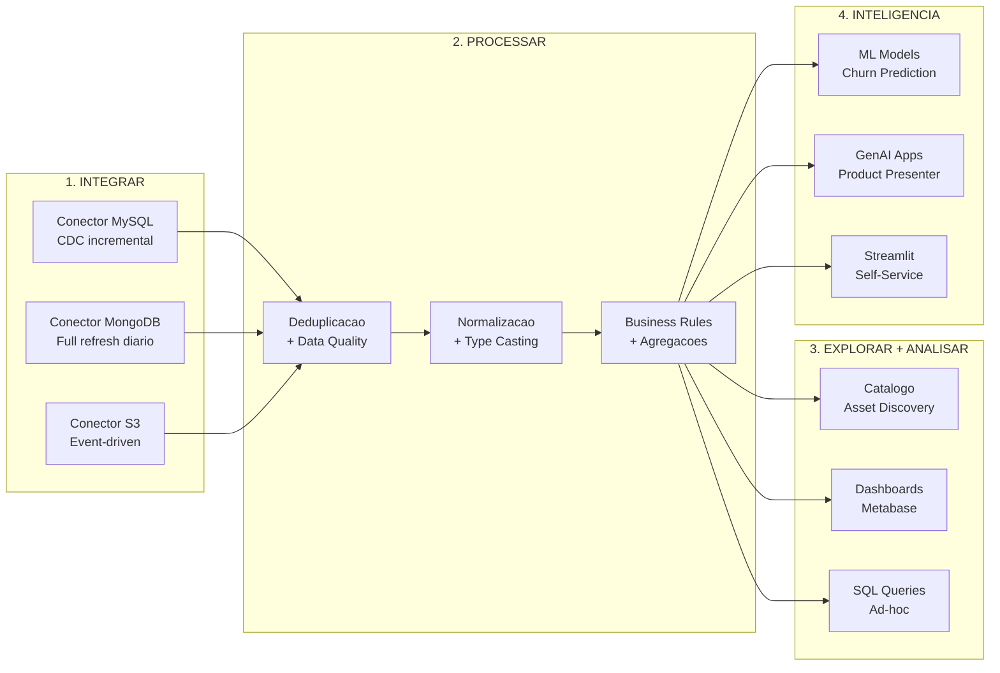

# Apresentacao de Arquitetura — Dadosfera como Plataforma Unificada

> **Caso Tecnico:** Dadosfera Data Platform
> **Documento:** 10 — Arquitetura Atual vs. Proposta Dadosfera
> **Data:** Abril de 2026
> **Versao:** 1.0

---

## 1. Visao Geral

Este documento apresenta a analise comparativa entre a arquitetura de dados atual de um e-commerce tipico e a arquitetura proposta utilizando a plataforma Dadosfera. O objetivo e demonstrar que a Dadosfera pode substituir total ou parcialmente o stack tecnologico existente, reduzindo complexidade operacional, custo total de propriedade (TCO) e tempo de entrega de valor (time-to-insight).

A analise segue tres eixos:
1. **Viabilidade tecnica** — o que a Dadosfera cobre nativamente
2. **Reducao de complexidade** — consolidacao de ferramentas
3. **Oportunidades futuras** — capacidades habilitadas pela plataforma unificada

---

## 2. Arquitetura Atual do Cliente

### 2.1 Diagrama da Arquitetura Atual

```
+------------------+     +------------------+     +------------------+
|   FONTES DE      |     |   ORQUESTRACAO   |     |   ARMAZENAMENTO  |
|   DADOS          |     |   & ETL          |     |                  |
+------------------+     +------------------+     +------------------+
|                  |     |                  |     |                  |
| MySQL            |---->| Apache Airflow   |---->| Amazon Redshift  |
| (transacional)   |     | (DAGs Python)    |     | (Data Warehouse) |
|                  |     |                  |     |                  |
| MongoDB          |---->| Scripts Python   |     | S3               |
| (catalogo)       |     | (custom ETL)     |     | (Data Lake)      |
|                  |     |                  |     |                  |
| Redis            |     | Cron Jobs        |     |                  |
| (cache/sessoes)  |     | (legacy)         |     |                  |
|                  |     |                  |     |                  |
| S3 Logs          |     |                  |     |                  |
| (clickstream)    |     |                  |     |                  |
+------------------+     +------------------+     +------------------+
         |                        |                        |
         v                        v                        v
+------------------+     +------------------+     +------------------+
|   VISUALIZACAO   |     |   MACHINE        |     |   GOVERNANCA     |
|   & BI           |     |   LEARNING       |     |                  |
+------------------+     +------------------+     +------------------+
|                  |     |                  |     |                  |
| Tableau          |     | Jupyter em EC2   |     | Controle manual  |
| (10 licencas)    |     | (notebooks)      |     | (planilhas)      |
|                  |     |                  |     |                  |
| PowerBI          |     | MLflow           |     | Sem catalogo     |
| (5 licencas)     |     | (experiment      |     | de dados         |
|                  |     |  tracking)       |     |                  |
|                  |     |                  |     | Sem PII          |
|                  |     | Deploy manual    |     | tracking         |
|                  |     | (Flask em EC2)   |     |                  |
+------------------+     +------------------+     +------------------+
```

### 2.2 Diagrama Mermaid — Arquitetura Atual



### 2.3 Pontos de Dor da Arquitetura Atual

| # | Ponto de Dor | Impacto | Severidade |
|---|-------------|---------|------------|
| 1 | **Fragmentacao de ferramentas** — 8+ ferramentas distintas para gerenciar | Alto custo operacional, curva de aprendizado | Critica |
| 2 | **Orquestracao fragil** — mix de Airflow, scripts e cron jobs | Falhas silenciosas, sem observabilidade unificada | Alta |
| 3 | **Custo de licenciamento** — Tableau + PowerBI + Redshift + EC2 | TCO elevado, contratos anuais rigidos | Alta |
| 4 | **Ausencia de catalogo** — ninguem sabe quais dados existem | Retrabalho, duplicacao de pipelines | Alta |
| 5 | **Governanca manual** — controle de acesso via planilhas | Risco de compliance (LGPD), sem auditoria | Critica |
| 6 | **Deploy de ML artesanal** — notebooks em EC2 com Flask | Sem versionamento, sem rollback, sem monitoramento | Media |
| 7 | **Equipe especializada** — requer DevOps, DBA, DE, DS, BI separados | Custo de contratacao, silos organizacionais | Alta |
| 8 | **Sem capacidade GenAI** — nenhuma integracao com LLMs | Perda de oportunidade competitiva | Media |

---

## 3. Arquitetura Proposta — Dadosfera

### 3.1 Diagrama da Arquitetura Dadosfera

```
+------------------+     +--------------------------------------------------+
|   FONTES DE      |     |              DADOSFERA PLATFORM                   |
|   DADOS          |     |                                                  |
+------------------+     |  +--------------------------------------------+  |
|                  |     |  |  INTEGRAR (Coletar)                        |  |
| MySQL            |---->|  |  25+ conectores nativos                    |  |
| (transacional)   |     |  |  Scheduling automatico                     |  |
|                  |     |  |  CDC / Batch / API                         |  |
| MongoDB          |---->|  +--------------------------------------------+  |
| (catalogo)       |     |           |                                      |
|                  |     |           v                                      |
| Redis            |---->|  +--------------------------------------------+  |
| (cache/sessoes)  |     |  |  SNOWFLAKE BACKEND                        |  |
|                  |     |  |                                            |  |
| S3 Logs          |---->|  |  RAW ──> TRUSTED ──> REFINED              |  |
| (clickstream)    |     |  |  (Bronze)  (Silver)   (Gold)              |  |
|                  |     |  |                                            |  |
| APIs Externas    |---->|  |  Time Travel | Zero-Copy Clones           |  |
| (pagamentos)     |     |  +--------------------------------------------+  |
+------------------+     |           |                                      |
                         |           v                                      |
                         |  +--------------------------------------------+  |
                         |  |  PROCESSAR                                 |  |
                         |  |  Jupyter | VSCode | Spark Connect          |  |
                         |  |  Step Connectors (transformacao)           |  |
                         |  +--------------------------------------------+  |
                         |           |                                      |
                         |     +-----+-----+                                |
                         |     |           |                                |
                         |     v           v                                |
                         |  +----------+ +-------------------------------+  |
                         |  | EXPLORAR | | ANALISAR                      |  |
                         |  | Catalogo | | Metabase (embedded)           |  |
                         |  | SQL IDE  | | Dashboards                    |  |
                         |  | Data     | | SQL Queries                   |  |
                         |  | Diction. | | Embedding p/ apps             |  |
                         |  +----------+ +-------------------------------+  |
                         |     |           |                                |
                         |     v           v                                |
                         |  +--------------------------------------------+  |
                         |  |  INTELIGENCIA                              |  |
                         |  |  ML Models | GenAI | Streamlit Apps        |  |
                         |  |  Flask APIs | LLM Integration             |  |
                         |  +--------------------------------------------+  |
                         |                                                  |
                         |  +--------------------------------------------+  |
                         |  |  GOVERNANCA (transversal)                  |  |
                         |  |  IAM | RLS | MFA | PII Reports | Audit    |  |
                         |  +--------------------------------------------+  |
                         +--------------------------------------------------+
```

### 3.2 Diagrama Mermaid — Arquitetura Dadosfera



### 3.3 Mapeamento: Ferramenta Atual --> Modulo Dadosfera

| Componente Atual | Ferramenta | Modulo Dadosfera | Status |
|-----------------|-----------|-----------------|--------|
| Ingestao de dados | Apache Airflow + Scripts | **Integrar** — 25+ conectores nativos | Substituicao total |
| Data Warehouse | Amazon Redshift | **Snowflake Backend** — gerenciado | Substituicao total |
| Data Lake | S3 (manual) | **Snowflake Backend** — zonas Raw/Trusted/Refined | Substituicao total |
| Transformacao | Python Scripts + SQL | **Processar** — Jupyter, Spark Connect, Steps | Substituicao total |
| BI / Dashboards | Tableau (10 lic.) + PowerBI (5 lic.) | **Analisar** — Metabase integrado | Substituicao total |
| Catalogo de dados | Inexistente | **Explorar** — catalogo nativo + data dictionary | Capacidade nova |
| Machine Learning | Jupyter em EC2 + MLflow | **Inteligencia** — notebooks + Streamlit apps | Substituicao total |
| Deploy de modelos | Flask manual em EC2 | **Inteligencia** — Streamlit Data Apps + Flask APIs | Substituicao total |
| Governanca | Planilhas + controle manual | **Governanca** — IAM, RLS, MFA, PII, audit logs | Capacidade nova |
| GenAI | Inexistente | **Inteligencia** — GenAI nativo | Capacidade nova |

---

## 4. Fluxo de Dados na Dadosfera

### 4.1 Arquitetura Medallion (Raw --> Trusted --> Refined)

```
FONTES                RAW (Bronze)           TRUSTED (Silver)        REFINED (Gold)
                      Dados brutos           Dados limpos            Dados de negocio
                      Schema-on-read         Schema validado         Star Schema

MySQL Orders    -->   raw.olist_orders   -->  trusted.orders     -->  refined.fct_orders
MySQL Items     -->   raw.olist_items    -->  trusted.order_items -->  refined.fct_order_items
MongoDB Catalog -->   raw.products       -->  trusted.products    -->  refined.dim_products
S3 Logs         -->   raw.clickstream    -->  trusted.events      -->  refined.fct_page_views
API Payments    -->   raw.payments       -->  trusted.payments    -->  refined.dim_payment_method
```

### 4.2 Pipeline de Dados Completo



---

## 5. Analise de Viabilidade Tecnica

### 5.1 Comparacao Feature-by-Feature

| Capacidade | Arquitetura Atual | Dadosfera | Vantagem |
|-----------|------------------|-----------|----------|
| **Ingestao batch** | Airflow DAGs (manutencao propria) | Conectores nativos com scheduling | Dadosfera: zero manutencao de infra |
| **Ingestao CDC** | Debezium + Kafka (complexo) | Conector CDC nativo | Dadosfera: setup em minutos |
| **Ingestao API** | Scripts Python custom | Conector REST/API generico | Dadosfera: configuracao visual |
| **Transformacao SQL** | dbt ou scripts manuais | SQL IDE integrado + Steps | Dadosfera: ambiente unificado |
| **Transformacao Python** | Jupyter em EC2 (isolado) | Jupyter/VSCode integrado | Dadosfera: acesso direto aos dados |
| **Processamento distribuido** | Spark em EMR (caro) | Spark Connect nativo | Dadosfera: sem gerenciar cluster |
| **Data Warehouse** | Redshift (autogerido) | Snowflake (gerenciado) | Dadosfera: elasticidade, Time Travel |
| **Data Lake** | S3 com Glue Catalog | Zonas Medallion no Snowflake | Dadosfera: catalogo integrado |
| **BI e dashboards** | Tableau + PowerBI | Metabase integrado | Dadosfera: sem licencas extras |
| **Embedded analytics** | Tableau Embedded (caro) | Metabase embedding nativo | Dadosfera: custo zero adicional |
| **Catalogo de dados** | Inexistente | Catalogo nativo + data dictionary | Dadosfera: capacidade nova |
| **Data quality** | Great Expectations (manual) | Validacao em Step Connectors | Dadosfera: integrado ao pipeline |
| **Governanca de acesso** | IAM AWS + controle manual | IAM + RLS + MFA nativos | Dadosfera: LGPD-ready |
| **PII detection** | Inexistente | PII Reports automaticos | Dadosfera: capacidade nova |
| **ML development** | Jupyter + MLflow + EC2 | Jupyter + Streamlit Apps | Dadosfera: do notebook ao deploy |
| **ML deployment** | Flask manual + EC2 | Streamlit Data Apps + Flask APIs | Dadosfera: deploy integrado |
| **GenAI / LLMs** | Inexistente | GenAI nativo + integracao OpenAI | Dadosfera: capacidade nova |
| **Audit trail** | CloudTrail (limitado) | Audit logs nativos | Dadosfera: rastreabilidade completa |

### 5.2 O Que a Dadosfera Cobre Nativamente

**Cobertura total (substituicao direta):**
- Ingestao de dados (batch, CDC, API)
- Armazenamento (DW + Data Lake unificado)
- Transformacao (SQL + Python + Spark)
- Visualizacao e BI (Metabase)
- Machine Learning (desenvolvimento + deploy)
- Governanca (IAM, RLS, MFA, PII, audit)

**Capacidades novas (inexistentes no stack atual):**
- Catalogo de dados com data dictionary
- Deteccao automatica de PII
- Integracao GenAI nativa
- Data Apps self-service via Streamlit
- Time Travel para auditoria de dados

### 5.3 Pontos de Integracao Externa

| Cenario | Ferramenta Externa | Integracao via Dadosfera |
|---------|-------------------|-------------------------|
| Orquestracao complexa multi-sistema | Apache Airflow | API Dadosfera como operator |
| Streaming real-time (sub-segundo) | Apache Kafka / Flink | Ingestao dos topicos via conector |
| Data mesh com dominio autonomo | Custom governance layer | API de catalogo Dadosfera |
| CI/CD de pipelines | GitHub Actions | Scripts de deploy via API |
| Monitoramento de infra | Datadog / Grafana | Metricas exportadas via API |

---

## 6. Analise de Custo (TCO)

### 6.1 Custo Estimado — Arquitetura Atual

| Componente | Custo Mensal (USD) | Observacao |
|-----------|-------------------|------------|
| Amazon Redshift (dc2.large x2) | $3,600 | Reserva anual, 2 nos |
| EC2 (Airflow + Jupyter + Flask) | $1,200 | 4 instancias t3.xlarge |
| S3 (Data Lake) | $200 | ~2TB de dados |
| Tableau (10 Creator licenses) | $7,000 | $70/usuario/mes |
| PowerBI (5 Pro licenses) | $500 | $100/usuario/mes (com Premium) |
| MLflow (EC2 + RDS) | $400 | Infraestrutura dedicada |
| DevOps / manutencao | $2,000 | ~0.25 FTE dedicado |
| **TOTAL MENSAL** | **$14,900** | |
| **TOTAL ANUAL** | **$178,800** | |

### 6.2 Custo Estimado — Dadosfera

| Componente | Custo Mensal (USD) | Observacao |
|-----------|-------------------|------------|
| Dadosfera Platform (Business) | $5,000 - $8,000 | Plataforma unificada |
| Consumo Snowflake (incluso) | Incluso | Elastico, pay-per-query |
| Usuarios adicionais | Variavel | Conforme plano |
| **TOTAL MENSAL (estimado)** | **$5,000 - $8,000** | |
| **TOTAL ANUAL (estimado)** | **$60,000 - $96,000** | |

### 6.3 Economia Projetada

| Metrica | Valor |
|---------|-------|
| **Reducao de TCO** | 46% a 66% |
| **Economia anual estimada** | $82,800 a $118,800 |
| **Ferramentas eliminadas** | 8 ferramentas --> 1 plataforma |
| **Licencas eliminadas** | Tableau (10) + PowerBI (5) + Redshift + MLflow |
| **Reducao de FTE operacional** | ~0.25 FTE (DevOps/manutencao de infra) |

### 6.4 Custos Intangiveis Eliminados

| Custo Oculto | Situacao Atual | Com Dadosfera |
|-------------|---------------|---------------|
| Tempo de onboarding | 3-4 semanas (8+ ferramentas) | 1 semana (1 plataforma) |
| Risco de compliance | Alto (governanca manual) | Baixo (LGPD-ready nativo) |
| Shadow IT / dados duplicados | Frequente (sem catalogo) | Controlado (catalogo central) |
| Tempo para novo dashboard | 2-3 dias (acesso + licenca + ETL) | Horas (self-service) |
| Incidentes de pipeline | Frequentes (multi-tool) | Raros (observabilidade integrada) |

---

## 7. Plano de Migracao

### 7.1 Fases de Migracao

```
Fase 1 (Semanas 1-2)          Fase 2 (Semanas 3-4)         Fase 3 (Semanas 5-6)
+---------------------+       +---------------------+       +---------------------+
| FUNDACAO             |       | MIGRACAO DE DADOS   |       | VALOR AVANCADO      |
|                     |       |                     |       |                     |
| - Setup Dadosfera   |       | - Conectores MySQL  |       | - ML notebooks      |
| - Definir zonas     |       | - Conectores MongoDB|       | - GenAI Data Apps   |
|   Raw/Trusted/Ref.  |       | - Conectores S3     |       | - Streamlit apps    |
| - Configurar IAM    |       | - Migrar dashboards |       | - Embedded analytics|
| - Mapear catalogo   |       |   Tableau->Metabase |       | - Treinamento time  |
| - Pipeline piloto   |       | - Validar data qual.|       | - Descomissionar    |
|                     |       |                     |       |   ferramentas legacy|
+---------------------+       +---------------------+       +---------------------+
```

### 7.2 Riscos da Migracao

| Risco | Probabilidade | Impacto | Mitigacao |
|-------|--------------|---------|-----------|
| Perda de dados na migracao | Baixa | Critico | Validacao row-count + checksum em cada etapa |
| Downtime de dashboards | Media | Alto | Operacao paralela por 2 semanas |
| Resistencia da equipe | Media | Medio | Treinamento hands-on + champions internos |
| Conectores faltantes | Baixa | Medio | API generica + scripts de ingestao custom |
| Performance diferente | Baixa | Medio | Benchmark antes da migracao completa |

---

## 8. Oportunidades Futuras

### 8.1 GenAI para Experiencia do Cliente

Com a Dadosfera, o e-commerce pode habilitar casos de uso de GenAI que seriam inviaveis no stack atual:

| Caso de Uso | Descricao | Modulo Dadosfera |
|------------|-----------|-----------------|
| **Product Presenter** | Geracao automatica de copy de marketing, imagens e SEO keywords usando GPT-4o + DALL-E | Inteligencia (Streamlit App) |
| **Review Summarizer** | Resumo automatico de avaliacoes de clientes por LLM | Inteligencia (GenAI) |
| **Chatbot de Suporte** | Atendimento ao cliente baseado em RAG sobre FAQ e historico | Inteligencia (Flask API) |
| **Recomendacao Semantica** | Busca de produtos por similaridade de embeddings | Inteligencia (ML Models) |
| **Deteccao de Fraude** | Analise de padroes anomalos em pagamentos via ML | Inteligencia (ML Models) |

### 8.2 Pipelines Real-Time

A arquitetura Dadosfera permite evolucao para processamento near-real-time:

```
ATUAL: Batch Diario                    FUTURO: Near Real-Time
+------------------+                   +------------------+
| MySQL CDC         |                   | MySQL CDC         |
| (daily dump)     |                   | (streaming)       |
|     |            |                   |     |             |
|     v            |                   |     v             |
| Airflow DAG      |                   | Conector CDC      |
| (batch T+1)     |                   | (micro-batch 5m)  |
|     |            |                   |     |             |
|     v            |                   |     v             |
| Redshift         |                   | Snowflake         |
| (refresh 1x/dia)|                   | (Snowpipe)        |
|     |            |                   |     |             |
|     v            |                   |     v             |
| Dashboard        |                   | Dashboard Live    |
| (dados de ontem) |                   | (dados de 5m atras)|
+------------------+                   +------------------+
```

### 8.3 Democratizacao de Dados

| Iniciativa | Antes (stack atual) | Depois (Dadosfera) |
|-----------|--------------------|--------------------|
| Self-service analytics | Impossivel (requer SQL + acesso Redshift) | Metabase visual + catalogo navegavel |
| Data literacy | Baixa (dados em silos) | Alta (data dictionary + catalogo) |
| Equipe de dados necessaria | 5-8 especialistas | 2-3 generalistas |
| Tempo para nova analise | Dias (ticket -> DE -> BI) | Horas (self-service) |
| Governanca | Bloqueante (medo de vazamento) | Habilitante (RLS + PII automatico) |

### 8.4 Embedded Analytics

A Dadosfera permite integrar dashboards diretamente em aplicacoes do e-commerce:

| Aplicacao | Dashboard Embedded | Valor para o Usuario Final |
|----------|-------------------|---------------------------|
| Portal do vendedor | Performance de vendas, ranking | Vendedor acompanha resultados em tempo real |
| App do cliente | Historico de pedidos, status | Cliente tem visibilidade sem suporte |
| Painel administrativo | KPIs operacionais, alertas | Gestao com dados, nao intuicao |
| Portal de parceiros | Comissoes, conversao | Transparencia na relacao comercial |

---

## 9. Conclusao

### 9.1 Resumo da Proposta

| Dimensao | Antes | Depois |
|----------|-------|--------|
| **Ferramentas** | 8+ ferramentas isoladas | 1 plataforma unificada |
| **TCO anual** | ~$178,800 | ~$60,000 - $96,000 |
| **Time-to-insight** | Dias a semanas | Horas |
| **Governanca** | Manual, arriscada | Automatica, LGPD-ready |
| **GenAI** | Inexistente | Nativo |
| **Self-service** | Impossivel | Habilitado |
| **Catalogo** | Inexistente | Completo |
| **Equipe necessaria** | 5-8 especialistas | 2-3 generalistas |

### 9.2 Recomendacao

A migracao para a Dadosfera e recomendada com base em tres argumentos:

1. **Reducao de complexidade:** consolidacao de 8+ ferramentas em uma plataforma unificada elimina integracao, manutencao e licenciamento fragmentado.

2. **Habilitacao de novas capacidades:** catalogo de dados, governanca automatica e GenAI nativo sao capacidades inexistentes no stack atual que geram valor imediato.

3. **Economia significativa:** reducao de 46-66% no TCO anual, com possibilidade de realocar budget para inovacao em vez de manutencao de infraestrutura.

---

**Confianca:** 0.92 | **Impacto:** Critico
**Fontes:** Documentacao Dadosfera | Analise de stack e-commerce tipico | Benchmarks de mercado SaaS Data Platform
